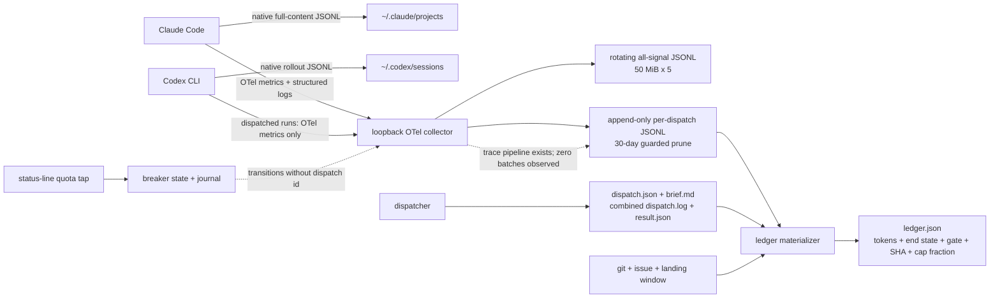
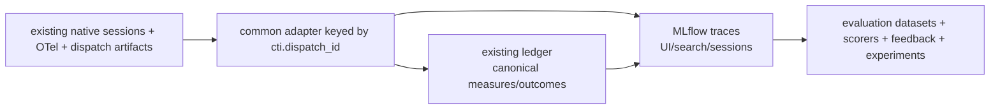

# Claude Code, Codex CLI, and MLflow observability gap analysis

**Assessed:** 2026-08-07

**Status:** Dated supporting evidence for the MLflow boundary adopted by
[target-state specification #376](https://github.com/andrewesweet/arma-cti/issues/376)
and [MVP specification #377](https://github.com/andrewesweet/arma-cti/issues/377).
Version-specific observations are a snapshot, not current process authority.

**Local versions:** Claude Code 2.1.224, Codex CLI 0.146.1, OpenTelemetry Collector Contrib 0.157.0

**MLflow reference:** 3.15.1, current `latest` documentation, and current first-party integration source
**Decision:** **there is not parity between Claude Code and Codex today, and MLflow should not replace the load-bearing local infrastructure. Pilot MLflow now as an experiment and offline-evaluation plane, selectively as an experimental-prompt registry, and as an optional trace-analysis plane over retained local evidence. Adopt each surface only after it passes the reconciliation and privacy bar below.**

## Executive answer

The current system has three different layers that are easy to conflate:

1. **Native CLI session records.** Both CLIs keep rich local JSONL. Claude records full conversation and tool history with per-response token usage; Codex rollout files record conversation items, function/custom-tool calls, encrypted reasoning plus summaries, turn context, and cumulative/per-turn token counts. The data richness is roughly comparable, but the schemas and lifecycle differ and there is no committed cross-CLI session reader.
2. **Streaming OpenTelemetry.** Claude currently sends metrics and structured log events. Dispatched Codex sends metrics only. The collector is trace-ready, but the durable exports inspected for this analysis contain **zero trace batches**. This layer is not at parity.
3. **Project evidence.** Every dispatch has a plan, brief, combined process log, and result. The materialized ledger joins telemetry to lane/profile/seat, issue, base SHA, end state, gate outcome, and landed SHA, and translates Claude subscription usage into a measured fraction of plan limits. That is unusually strong and intentionally project-specific. MLflow does not supply it.

MLflow meets or exceeds the missing generic layer: navigable agent traces, trace search, token/latency dashboards, sessions and tags, evaluation datasets, feedback, custom and LLM-judge scorers, regression/CI workflows, experiment comparison, retention/archival, and access control. It does **not** ingest the arbitrary OTel logs and metrics that feed the current ledger; its OTLP server endpoint is for traces. Its built-in USD cost is API-list-price-based, which both MLflow and this repository warn is not actual spend for subscription-backed CLIs. It also does not know what an arma-cti issue, seat, mechanical gate, landing window, plan-cap fraction, or breaker transition means.

The same boundary applies to prompts. MLflow supplies immutable template versions,
diffs, aliases, run/trace lineage, evaluation, and optimizers. The repository's
`CLAUDE.md`, `.claude/agents/`, `.claude/skills/`, and mechanically composed dispatch
briefs are also policy, permissions, tool contracts, model/effort selection, and files
the coding CLIs discover natively. They stay in Git. MLflow should initially own only
the experimental wrapper prompts and scoring rubrics used by the planned decision-replay
work.

The right boundary is therefore:

- **Keep as system of record:** the loopback collector, rotating all-signal capture, durable per-dispatch export, dispatch artifacts, normalized ledger, quota tap, breaker/admission journals, and git/gate join.
- **Pilot MLflow for:** user-facing traces, search and comparison, experiment/run organization, evaluation datasets, feedback, scorers, and dashboards.
- **Use MLflow Prompt Registry for:** versioned experiment prompts and rubrics whose performance is measured across a dataset.
- **Do not build:** a bespoke trace UI, general experiment database, annotation UI, experimental-prompt/evaluation-dataset registry, or optimizer framework.
- **Do not retire anything initially.** Run a bounded local pilot, validate completeness and non-interference, then retire only ad-hoc transcript-analysis scripts or future UI work that MLflow demonstrably replaces.

MLflow's GenAI surface is also moving quickly. Codex tracing arrived recently, and the current Claude page still shows both the recommended TypeScript plugin and an older Python/`mlflow autolog claude` setup path that the changelog says has been superseded. “Latest” is not an operational contract; pin the server and both adapters and validate their live setup. [MLflow changelog](https://github.com/mlflow/mlflow/blob/master/CHANGELOG.md)

## Scope and evidence

This analysis reads:

- the live Claude and Codex configurations, collector configuration, native session-file schemas, durable dispatch exports, and materialized rows on this box;
- the implementation and focused tests for `dispatch.py`, `ledger.py`, `breaker.py`, `prereqs.py`, and hook parity;
- the repository's earlier measured research, especially [the dispatch ledger](../telemetry-ledger.md), [agent observability and cost ledgers](agent-observability-and-cost-ledgers.md), [the Codex live findings](codex-lane-live-findings.md), and [the plan-currency calibration](token-efficiency-plan-currency.md);
- current first-party [MLflow GenAI](https://mlflow.org/docs/latest/genai/), [Claude Code integration](https://mlflow.org/docs/latest/genai/tracing/integrations/listing/claude_code/), [Codex CLI integration](https://mlflow.org/docs/latest/genai/tracing/integrations/listing/codex/), [tracing](https://mlflow.org/docs/latest/genai/tracing/), [evaluation](https://mlflow.org/docs/latest/genai/eval-monitor/), and [OpenTelemetry integration](https://mlflow.org/docs/latest/genai/tracing/opentelemetry/) documentation;
- current first-party [Claude Code monitoring](https://code.claude.com/docs/en/monitoring-usage) documentation.

Focused observability tests pass. The command needed to remove this Codex process's ambient `CODEX_HOME`, otherwise one prerequisites test correctly tried to write to the real Codex home rather than its temporary layout:

```text
env -u CODEX_HOME UV_CACHE_DIR=/tmp/codex-mlflow-gap-uv-cache \
  uv run pytest -q -n0 \
  tests/unit/test_ledger.py tests/unit/test_dispatch.py \
  tests/unit/test_breaker.py tests/unit/test_prereqs.py \
  tests/unit/test_hook_parity.py
```

The local inventory is a point-in-time observation, not a benchmark: 840 Claude JSONL session files (959 MiB), 40 Codex rollout files (15 MiB), 25 durable raw dispatch exports, 25 dispatch records/logs/results, and 6 materialized ledger rows. The 25-to-6 mismatch matters: materialization is manual and most completed dispatches do not yet have the normalized row that downstream analysis expects.

## The current data path



The architecture has a sound separation: vendor telemetry is captured once, and the project-specific ledger is a materialized view. The main weakness is that native sessions, streaming signals, and the final ledger do not yet form one consistently populated cross-CLI model.

## Claude Code versus Codex: current parity

Legend: **yes** means operating now; **partial** means data exists but is asymmetric or not operationalized; **no** means absent from the current path.

| Capability | Claude Code now | Codex now | Parity? | Consequence |
|---|---|---|---|---|
| Native session persistence | **Yes.** Full JSONL with user/assistant/tool records, file-history records, model/effort, and response usage | **Yes.** Rollout JSONL with session/turn context, prompts/responses, tool calls/results, reasoning summaries, and token-count events | **Partial** | Rich raw evidence exists for both, but no common reader, schema, retention policy, or stable API |
| Streaming OTel metrics | **Yes.** Tokens, list-price cost, active time, sessions, edits/LOC, commits, and tool decisions were observed | **Yes.** Tokens plus extensive turn, latency, tool, hook, skill, MCP, websocket, startup, rollout, memory, and multi-agent metrics | **Partial** | Both are measurable, but metric names, aggregation types, dimensions, and semantic scope differ |
| Structured OTel logs/events | **Yes.** API requests, redacted prompts/responses, tool decisions/results, hooks, plugins, MCP connections | **No for dispatched Codex.** The dispatcher configures only `metrics_exporter` | **No** | Codex end-state/error/refusal and step evidence cannot be derived from the same streaming bus |
| OTel traces | **No batches observed.** Claude tracing is available but not enabled | **No batches observed.** Codex trace export is not enabled | **No** | The collector's trace pipelines are ready but idle; there is no navigable causal tree |
| Tool inputs/outputs in streaming data | Structural names, sizes, timing and success; content deliberately redacted/disabled | Metrics about tool calls, but no streamed conversation/tool result logs | **No** | Current privacy is strong, but step-level debugging depends on native session files |
| Subagent and skill structure | Native sessions and vendor events carry agent/skill information; Claude native traces can nest Task subagents when enabled | Rollouts and metrics carry multi-agent/skill signals, but the ledger does not reconstruct a nested run | **No** | Delegation quality and token attribution cannot be compared in one model |
| Token usage | Native JSONL and OTel include input, output, cache read, cache creation; Claude also distinguishes 5-minute/1-hour cache writes in transcripts | Native JSONL includes input, output, cached input, cache-write input, reasoning output, total; OTel ledger normalizes input/output/cache read/cache write | **Mostly** | The common ledger deliberately excludes non-disjoint Codex total/reasoning buckets; detailed cross-CLI analysis still needs raw-schema knowledge |
| Per-call timing | API duration, active time, hook/tool durations | Rich TTFT/TTFM/TBT/inference/overhead/tool/turn metrics | **Partial** | Codex is actually richer at the metric layer, but no common latency vocabulary or dashboard exists |
| Dollar cost | Claude emits API-list-price USD; repository correctly labels it `list_price_usd` | No equivalent current ledger cost | **No, by design** | API-list-price parity would be misleading for both subscription pools |
| Actual plan consumption | Claude output tokens have a measured five-hour and weekly cap-fraction calibration | Numerator exists; Codex plan denominator has not been measured | **No** | Token efficiency comparisons cannot yet say how close Codex moves its subscription wall |
| Quota state | Claude status-line spool provides first-party window state and reset times | Codex rate-limit documents can be parsed by the breaker, but no equivalent dispatch-attributed observed half reaches ledger rows | **Partial** | Availability routing exists, per-dispatch observed consumption does not |
| Dispatch correlation | `cti.dispatch_id/lane/profile/seat/issue/base_sha` on every exported record | Same resource attributes on every exported batch | **Yes** | This is the strongest parity seam and should become the common join key everywhere |
| Process stdout/stderr and exit | `dispatch.log` plus timestamped `result.json` | Same | **Yes** | MLflow traces would complement, not replace, the process record |
| Quality/gate outcome | Ledger joins issue, bounded landing window, SHA, end state, and gate outcome | Same lane-agnostic join | **Yes when materialized** | Only 6 of 25 current dispatch records have a row, so operational completeness is weak |
| Durable per-dispatch raw evidence | Collector `group_by`, append-only; guarded 30-day prune | Same | **Yes** | Stronger audit semantics than a UI database by itself |
| Search, dashboard, comparison | Grep/JQ, one-row CLI, bespoke research scripts | Same, but fewer scripts understand Codex | **No practical parity** | Data is collectable but expensive to explore repeatedly |
| General experiments/evaluations | One bespoke pre-registered orchestration trial and issue-specific A/B analyses | Same mechanisms can include Codex | **Partial** | Strong methodology in narrow cases, no general experiment/run/dataset/scorer plane |

### What is already at parity

The dispatch boundary is the success. Both lanes receive the same six project resource attributes, produce the same four process artifacts, and can feed the same raw export and git/gate materializer. The ledger's cross-lane token normalizer handles Claude sums and Codex histograms without double-counting Codex `total` or `reasoning_output`. The quality outcome is provider-independent: a landing is bounded by issue, base SHA, and dispatch start, and non-result failure classes do not become failed quality results.

That is enough for a defensible **per-dispatch evidence record**, provided materialization runs. It is not enough for session-level debugging, tool-path comparison, or broad experiment analysis.

### The important asymmetries

1. **Claude has events; Codex has internal metrics.** Claude's records describe API/tool/hook/plugin activity. Codex exposes unusually detailed performance metrics but no current log stream. Neither is a semantic substitute for the other.
2. **The native files are richer than the common ledger.** Claude preserves cache TTL classes. Codex preserves reasoning tokens and turn context. A forced common denominator would discard measurements useful for token-efficiency work.
3. **There is no trace output despite a trace-ready collector.** This is configuration, not collector engineering, for basic vendor traces. Semantic trace parity is harder because the vendors' trace models differ.
4. **Cost parity is the wrong target.** The scarce resource is subscription-window capacity, not API list price. Claude is calibrated; Codex is explicitly unpriced. A dashboard showing USD for both would be neat and wrong.
5. **Collection and materialization are decoupled but not automated.** Raw evidence exists for 25 dispatches; rows exist for 6. Analyses that select only materialized rows have a large, non-random missing-data risk.
6. **Documentation has drifted behind the live lane.** `docs/telemetry-ledger.md` still says Codex is not yet a lane, and the installed Codex config retains an old “UNVERIFIED” note even though the live findings verified the schema and export. Capability documentation should be generated or tested against the active registry/configuration.

## What it takes to achieve Claude/Codex parity

Parity should mean **comparable answers**, not identical vendor records. Preserve lane-specific detail and define a required common contract.

### 1. Make the common measurement contract explicit

Add a versioned `cti.agent_observation` contract with these required concepts:

- identity: `dispatch_id`, provider session id, trace id, turn id, parent agent id;
- treatment: lane, profile, model, effort, seat, experiment id, arm, pair id, task class;
- usage: input, output, cache read, cache write, reasoning output, and whether each is measured, derived, non-disjoint, or unavailable;
- timing: wall, active, model, permission wait, tool execution;
- execution: prompt/turn counts, tool calls, failures, subagent count/depth, skill use;
- outcome: provider end state, return code, gate outcome, landing SHA, human assessment;
- economics: raw tokens, list-price estimate, plan pool, cap estimate, observed cap movement, calibration id;
- completeness: source files/signals seen, expected signals, missing reason, materialized-at version.

Do not collapse extensions. Claude's cache-TTL split and Codex's reasoning tokens should survive beside the shared totals.

### 2. Close streaming-signal gaps

- Enable Claude's structural beta traces for dispatched `claude -p` runs by adding `CLAUDE_CODE_ENHANCED_TELEMETRY_BETA=1` and `OTEL_TRACES_EXPORTER=otlp`; leave all `OTEL_LOG_*` content flags off. Claude documents interaction → LLM/tool/hook nesting, Task-subagent nesting, token/latency attributes, and default redaction. The collector already has both unfiltered and durable trace pipelines. [Claude Code monitoring](https://code.claude.com/docs/en/monitoring-usage)
- Extend `_codex_argv` to configure loopback **log and trace** exporters as well as metrics, per invocation. First capture their live shapes against a throwaway sink and add fixtures before making the ledger depend on them.
- Treat Codex native traces as operational traces, not conversation traces. MLflow's own Codex documentation says native Codex OTLP traces emphasize internal websocket/request/tool-scheduling details; its notify integration reconstructs the cleaner user-facing flow from the rollout file. [MLflow Codex integration](https://mlflow.org/docs/latest/genai/tracing/integrations/listing/codex/)
- Add a completeness assertion per finished dispatch: expected signal set by lane/version, last timestamp, session id, and an explicit partial flag. Never infer a clean zero from an absent signal.

### 3. Operationalize both native session stores

Write or adopt one versioned importer that maps both JSONL formats into the common contract while retaining raw provenance. It must:

- de-duplicate resumed Claude messages by message/request id;
- group Codex's per-turn records into provider sessions without losing turn-level traces;
- preserve nested tool/subagent relationships and model/effort changes;
- distinguish cache, reasoning, and ordinary output tokens;
- tolerate unknown record types and report them;
- never make native file retention the only copy of a result used in an experiment.

MLflow's CLI integrations can provide much of this view; adopting them is preferable to writing another general trace store. A small project adapter is still needed for `cti.*` identity and outcomes.

### 4. Finish economic parity honestly

Repeat the existing meter-displacement calibration for Codex after the lane's representative arm mix is stable. Record a calibration id and confidence/resolution, exactly as Claude does. Until then, Codex cap consumption remains `null` with a reason. Do not substitute MLflow's USD estimate: MLflow explicitly warns that API-pricing cost does not reflect subscription-plan spend. [MLflow Codex token and cost note](https://mlflow.org/docs/latest/genai/tracing/integrations/listing/codex/#token-usage-and-cost)

Also feed start/end quota readings onto the bus with `cti.dispatch_id` if a provider exposes sufficient resolution. That would fill the ledger's currently absent observed half and make the estimator falsifiable in aggregate.

### 5. Make materialization and experiment identity automatic

- Run ledger materialization in the dispatch finisher, idempotently, after final telemetry flush; retry from a separate reconciliation command when the collector is late.
- Add `cti.experiment_id`, `cti.arm`, and `cti.pair_id` at dispatch planning time. MLflow experiments/runs can then index the same values rather than inventing a second identity.
- Export gate outcome, landed SHA, end-state class, and cap fraction to MLflow as tags/metrics/assessments after materialization.
- Keep pre-registration and task sampling outside MLflow. MLflow stores and compares results; it does not solve moving-repository confounding, burned coding tasks, assignment bias, or the need for paired runs.

## MLflow versus the current system

### Capability comparison

| Capability | Current infrastructure | MLflow off the shelf | Verdict |
|---|---|---|---|
| Claude conversation tracing | Native JSONL plus structural OTel events; no trace UI | Automatic prompts/responses, tool inputs/outputs, full nested subagent traces, skills, per-call/session tokens/cost, latency, metadata | **MLflow exceeds** for exploration; current stream is safer and more crash-resilient |
| Codex conversation tracing | Rich rollout JSONL; metrics only on bus | Notify hook creates one AGENT trace per turn with LLM/TOOL children and optionally parses rollout for tools/tokens | **MLflow exceeds** operational usability, but is less rich than its Claude integration |
| Cross-CLI semantic parity | Custom token normalization and common dispatch identity only | Common trace model/UI, but integration granularity differs (Claude session vs Codex turn) | **Neither delivers parity alone** |
| Arbitrary OTel metrics and logs | **Yes**, collector captures and fans out both | MLflow server exposes `/v1/traces`; CLI integrations derive trace-level usage dashboards | **Current system exceeds** as the capture bus |
| Native/internal traces | Collector is ready but no source enabled | Ingests OTLP traces; Codex native trace supported alongside notify traces | **MLflow is a useful backend**, not the source |
| Token detail | Input/output/cache read/cache write; raw Claude TTL split and raw Codex reasoning tokens available | Standard trace usage is input/output/total at span and trace levels | **Current system exceeds** for token-efficiency research |
| Cost | Measured Claude plan-cap estimator, explicit list-price/non-spend distinction | Automatic estimated API USD and trend dashboard; manual overrides available | **Current system is correct for subscriptions; MLflow UI is convenient but hazardous unless relabeled** |
| Latency | Rich but vendor-specific metrics, no dashboard | Span/trace latency and monitoring UI | **MLflow exceeds** usability; raw Codex metrics remain richer |
| Dispatch/process evidence | Plan, brief, combined log, result, issue/base SHA/seat/profile | Generic trace metadata/tags | **Current system exceeds** |
| Gate and landed outcome | Bounded git join and typed non-result handling | Custom scorer/tag/assessment required | **Current system exceeds** |
| Quota and breaker state | First-party feeds, fallback parsing, state machine, durable journal and OTel transitions | Gateway budgets are a different control plane; CLI subscription windows are not handled | **Current system exceeds** |
| Retention and audit | Append-only raw files; guarded prune only after materialization; indefinitely retained rows | Configurable SQL-to-artifact archival, scoped retention, UI/API deletion, RBAC/workspaces; backups remain operator policy and archives are not append-only evidence | **MLflow exceeds lifecycle tooling; current system retains stronger evidence semantics** |
| Search and trace visualization | Grep/JQ and CLI row display | Rich trace UI, programmatic search, tags and sessions | **MLflow exceeds materially** |
| Experiment/run tracking | Issue records, custom ledger, one bespoke pre-registered trial | Mature experiments/runs, metrics, parameters, versions and comparison UI | **MLflow exceeds materially** |
| Evaluation datasets | Live issues/gates; deliberate refusal of a static coding benchmark for methodological reasons | Versioned datasets, trace-to-dataset workflows, expectations | **MLflow exceeds infrastructure**, not study design |
| Scoring | Mechanical repo gates and bespoke criteria; no general scorer registry | Built-in/custom scorers, LLM judges, systematic evaluation, CI regression | **Complementary**: keep gates; use MLflow for orchestration/storage |
| Human feedback | GitHub issue/ADR process and bespoke hand criteria | Feedback/assessment APIs with user/time/revision metadata | **MLflow exceeds the generic primitive**; existing approval semantics remain external |
| Prompt/version management | Git-managed agent instructions and skills | Prompt registry, lineage and optimization | **MLflow is useful for application prompts**, but CLI system prompts/skills are still file/version controlled |
| Privacy | Streaming content off by default; local raw native transcripts still contain full content | Coding-CLI integrations intentionally capture prompts, responses, and tool inputs/outputs; MLflow supports self-hosting and redaction tools | **Current default is safer**; MLflow needs an explicit content policy |
| Crash/abnormal termination | Metrics/logs stream every few seconds and process logs/results survive independently | Claude traces are exported when the session ends; Codex traces after each turn | **Current system exceeds for Claude crash diagnosis** |
| Operational burden | One collector plus flat files and project scripts | Tracking server, backend/artifact storage, Python/Node/plugin components, backups, upgrades | **MLflow adds a service**, but avoids building several larger product surfaces |

### MLflow integration parity is itself incomplete

MLflow does not erase the vendor asymmetry:

- Claude tracing is session-oriented, exported at session end, and explicitly includes nested subagent and skill traces, per-call/session cost, and step timing.
- Codex tracing is turn-oriented, exported after each conversation turn, driven by a `notify` hook, and optionally re-reads the rollout for tool calls and tokens. Its documented capture list does not promise Claude-equivalent nested subagent or skill structure.
- The Codex plugin's per-turn cadence is better for long sessions and crashes. Claude's current plugin uses a local write-ahead log and background retry daemon once it has produced a trace, but the documented trace unit is still written/exported only at session end. That improves delivery after the end hook; it does not prove recovery from a process or machine loss before the session trace is constructed. The local streaming OTel path remains the stronger abnormal-termination record. [MLflow 3.14 release notes](https://mlflow.org/releases/)
- MLflow's common token object contains input/output/total. More concretely, the current Codex parser type reads `cached_input_tokens` and `reasoning_output_tokens`, while its trace builder maps only input/output/total and drops both fields. Claude's integration preserves cache-read and cache-creation tokens. This is a source-level MLflow parity gap, not merely a missing dashboard. [Codex token type](https://github.com/mlflow/mlflow/blob/master/libs/typescript/integrations/codex/src/types.ts) · [Codex trace builder](https://github.com/mlflow/mlflow/blob/master/libs/typescript/integrations/codex/src/tracing.ts) · [Claude integration source](https://github.com/mlflow/mlflow/tree/master/libs/typescript/integrations/claude-code)

So MLflow provides a common **place** and a broadly common **shape**, not proven field-for-field parity.

### Where MLflow genuinely changes the build-versus-buy decision

The current repository should stop short of building the following because MLflow already supplies them:

- a trace database and interactive waterfall/tree viewer;
- searchable sessions/tags and usage/latency trend dashboards;
- experiment/run comparison and version lineage;
- evaluation dataset storage and trace-to-dataset promotion;
- feedback/annotation records;
- custom scorer and LLM-judge execution;
- regression/CI evaluation reporting;
- prompt registry/optimization where prompts are application artifacts rather than Claude/Codex configuration files.

Those capabilities are much broader than the current ledger and would be expensive distractions to reproduce.

## Evaluation and prompt-management fit

### Current and planned capability map

The repository already has unusually strong *domain* evaluation and unusually weak
*generic* experiment tooling. That distinction decides what should move.

| Need | Current or planned project capability | MLflow capability | Boundary |
|---|---|---|---|
| Run identity and evidence | `just dispatch` records lane/profile/seat/issue/base SHA, exact brief, log and typed result; the ledger joins usage and landing | Tracking runs, parameters, metrics, artifacts, nested runs and comparison UI | Mirror project identity and outcomes into MLflow; do not make MLflow generate or reinterpret them. |
| Coding correctness | `just fast`, mutation smoke, full in-world `just regress`, SHA-bound `just verdict` | Arbitrary Python scorers and per-row assessments | Wrap or import existing verdicts as scorers; never replace the oracle with a judge. |
| Provider admission | Ten fresh issues, pre-registered process/outcome bars, one retry, distinct citation bar | Scorer pass criteria and regression-test reporting | MLflow can present the evidence; `admission.py` keeps policy and state transitions. |
| Orchestration trial | Ten consecutive cycles, five predeclared criteria, mixed mechanical/human scoring | Runs, datasets, feedback and aggregates | Useful recording layer; the local trial remains the adjudicator. |
| Access/gate infrastructure (E1/E2/E6/E8) | Planned quota-access test, hook-parity suite, SHA-bound foreign corpus verdict, and golden settings/seat data | Generic run/artifact recording only | MLflow may record these experiments but removes none of their implementation. Keep them local. |
| Decision replay (E3) | Planned date-cut ADR/retro packets, blind human-ruling agreement and reasoning score | `mlflow.genai.evaluate`, datasets, per-case feedback, side-by-side runs | **Best first GenAI-eval adoption.** Keep packets and frozen manifest in Git; mirror them into MLflow with a digest. |
| Prompt authorship (E4) | Planned recovery-of-ruling and contradiction checks by blind readers | Prompt evaluation, exact prompt lineage, feedback/review UI | **Strong fit.** Deterministic contradiction checks and human recovery labels remain project-owned. |
| Gate corpora (E7/E9) | Planned seeded good/bad diffs and historical-defect catch rates | Dataset/run/result storage | Track them in MLflow, but execute the repository gates outside it. |
| Phase-3 acceptance harness ([#5](https://github.com/andrewesweet/arma-cti/issues/5)) | Planned declarative specs, independent oracle, typed verdicts, failure bundles, and coverage | Artifacts, scorer results and comparison | Use MLflow as a catalog of runs and bundles; it cannot replace Arma lifecycle/slot orchestration or the independent oracle. |
| Planner/cache/handoff experiments | Purpose-built metrics and evidence in issues/JSON/Markdown | Ordinary MLflow Tracking and artifacts | **Low-risk pilot.** These test the run schema and comparison UI without changing agent behavior. |
| Production prompt policy | Git-owned `CLAUDE.md`, agent files, skills, settings and brief composer | Prompt templates, aliases, cache, version diff | Keep in Git; duplicating them creates a split authority and loses native CLI discovery. |
| Experimental prompts/rubrics | Currently Git text or inline strings with no result lineage | Prompt Registry plus automatic run/trace linkage | Adopt once E3/E4 runners exist. Pin exact versions, not aliases, in evidence. |

MLflow's core offline API accepts records, data frames, evaluation datasets, or existing
traces; runs a supplied synchronous or asynchronous prediction function; executes code
scorers or judges; and stores row-level assessments plus aggregates in an experiment.
Existing outputs can be rescored without another model run. This directly replaces the
generic runner-result schema, aggregation, and comparison UI the E3/E4 programme would
otherwise have to build. It does not supply task randomization, paired design,
confidence intervals, flake policy, or a coding sandbox. [Offline evaluation](https://mlflow.org/docs/latest/genai/eval-monitor/running-evaluation/agents/) ·
[trace re-evaluation](https://mlflow.org/docs/latest/genai/eval-monitor/running-evaluation/traces/)

Managed evaluation datasets record inputs, expectations, provenance, associations, and
a content digest, and can evolve through merge/update operations. That is useful as a
working collection, but it is not the preregistered immutable corpus required by
[#262](https://github.com/andrewesweet/arma-cti/issues/262). The authoritative packet
manifest, date cut, contamination check, and content digest should remain in Git; each
MLflow run records the digest and may use a mirrored dataset for UI and feedback.
[Evaluation datasets](https://mlflow.org/docs/latest/genai/datasets/) ·
[dataset concepts](https://mlflow.org/docs/latest/genai/concepts/evaluation-datasets/)

Human feedback fits E3/E4 better than MLflow's LLM judges. Assessments retain source,
rationale, metadata, and revisions, and the UI supports reviewer changes without
discarding the earlier assessment. Review Queues add structured assignments, but the
current API is experimental, so the first pilot should use the stable feedback model or
a Git-owned reviewer allocation and treat queues as replaceable UI.
[Feedback](https://mlflow.org/docs/latest/genai/assessments/feedback/) ·
[Review Queues](https://www.mlflow.org/docs/latest/genai/assessments/review-queues/)

The [existing evaluation research](coding-agent-evaluation-and-routing-evidence.md)
deliberately rejected LLM-as-judge as the authority
for coding quality, and E3/E4 are designed around historical human rulings and blind
readers. Preserve that choice. Built-in judges, judge alignment, and automatic online
evaluation may later supply exploratory secondary signals, but must not decide
admission, gate validity, or prompt promotion. Automatic evaluation is an especially
poor first fit: it runs only LLM judges, requires an AI Gateway endpoint, does not retry
failed evaluations automatically, and is aimed at newly arriving production traces.
[Automatic evaluation](https://mlflow.org/docs/latest/genai/eval-monitor/automatic-evaluations/)

### Prompt Registry: useful at the experiment seam only

Prompt Registry stores text or chat templates as immutable sequential versions with
commit messages, metadata, diffs, search, and mutable aliases such as `staging` and
`production`. Loading a prompt in an active run or trace automatically records the exact
version relationship. That is precisely the missing lineage for E3 packet wrappers, E4
authorship prompts, and human/judge rubrics.
[Prompt Registry](https://mlflow.org/docs/latest/genai/prompt-registry/) ·
[aliases](https://mlflow.org/docs/latest/genai/prompt-registry/manage-prompt-lifecycles-with-aliases/) ·
[prompt evaluation](https://mlflow.org/docs/latest/genai/prompt-registry/evaluate-prompts/)

Three controls are required:

1. Historical evidence pins an **exact prompt version**. An alias is a mutable deployment
   pointer and cannot identify an experimental treatment.
2. Although template text is immutable within a version, stored `model_config` is
   mutable. Every run must retain the complete model/profile/configuration snapshot or
   enforce “configuration change means new prompt version” as local policy.
3. Registry use is one-way until promotion: MLflow generates experiment candidates;
   an accepted operational change is deliberately exported into Git and passes the
   existing review/gate process. Production code never silently loads an alias in place
   of `CLAUDE.md` or an agent/skill file.

### Prompt optimization: candidate generation, not autonomous improvement

`mlflow.genai.optimize_prompts()` connects registered prompts, a dataset, scorers, and
an optimizer, and logs the initial/final scores and newly registered prompt versions.
GEPA iteratively reflects on failures and searches candidate prompts; MLflow recommends
a clear metric and roughly 100 or more records and warns about cost and prompt growth.
MetaPromptOptimizer is a faster one-pass zero/few-shot rewrite, but remains experimental
and can register a candidate even when it did not improve the score.
[Prompt optimization](https://mlflow.org/docs/latest/genai/prompt-registry/optimize-prompts)

The planned historical corpus has at most the cited 65 ADRs and 25 retros before packet
and label-quality exclusions, so GEPA is not an immediate fit. After E3/E4 have stable
deterministic/human scoring and a frozen held-out split, try MetaPromptOptimizer only as
a candidate generator. Consider GEPA later if the usable training population grows past
roughly 100, the scorer is demonstrably discriminating, and quota cost is budgeted in
the project's measured plan currency. No optimizer result promotes itself; it must beat
the pinned baseline on untouched holdout cases and survive human review.

### How much home-grown code can disappear?

The honest answer is asymmetric:

- **A large share of unbuilt E3/E4 plumbing can disappear:** experiment tables, run and
  artifact persistence, per-item result schemas, aggregation, comparison UI, feedback
  records, experimental-prompt CRUD/diffs/lineage, and optimizer-loop scaffolding.
- **A modest share of future observability presentation can disappear:** trace search,
  waterfall/session views, common token/latency dashboards, and ad-hoc analysis scripts,
  after a parity/privacy pilot.
- **Almost none of the load-bearing operational code can disappear:** dispatch, briefs,
  provider configuration, gates, mutation and in-world runners, verdict rendering,
  admission, breaker, queue/worktree/landing coordination, raw OTel capture, the ledger,
  and plan-cap calibration all encode repository-specific semantics that MLflow neither
  knows nor should own.

The protected intellectual property is the corpus, oracle, experimental controls,
subscription economics, and routing/promotion policy. The commodity parts are storage,
indexing, generic UI, and framework orchestration. MLflow is a good way to stop the
second category from becoming accidental local IP.

## Retirement decision

### Do not retire the local evidence plane

MLflow does not meet the replacement bar for:

1. **Metrics and log capture.** Its OTLP ingestion endpoint is trace-only. Claude structured events and both vendors' native metrics are measurements, not incidental plumbing.
2. **Crash evidence.** The local pipeline streams during execution. Claude's MLflow write-ahead log protects traces already constructed at session end, but does not establish whole-session recovery when that end event never happens.
3. **Subscription economics.** MLflow's API-list-price cost is not actual CLI-plan usage. The ledger's cap fraction and calibration provenance are the decision variables.
4. **Project semantics.** Issue, seat, profile, base SHA, bounded landing, gate outcome, non-result classes, quota, and breaker state are not generic MLflow concepts.
5. **Audit and retention.** A raw append-only file plus a materialized row whose source and degradation are explicit is a stronger evidence record than relying on a mutable UI database without a separately designed backup/retention policy.
6. **Privacy defaults.** Existing streaming telemetry is structural and redacted. MLflow's useful coding-agent integrations capture content by design.

Wholesale replacement would remove measurements that MLflow cannot reproduce and introduce a misleading cost metric unless substantial custom work rebuilt the parts just retired.

### Pilot MLflow as a derived analysis plane

MLflow is worth adopting because it fills real gaps without requiring it to become canonical. The preferred flow is:



The existing raw files remain reproducible inputs. MLflow stores the exploration/evaluation view. Project outcomes flow **into** MLflow after the ledger decides them; MLflow does not independently reinterpret git or provider failures.

## Gains and losses

Adoption gains a coherent queryable history across experiments; per-case drill-down
rather than aggregate-only reports; dataset/prompt/result lineage; a reusable scorer
contract; human-feedback provenance; side-by-side comparisons; and an existing UI. It
also gives the project an [Apache-2.0 ecosystem](https://github.com/mlflow/mlflow/blob/master/LICENSE.txt) instead of committing to maintain a
small internal experiment product. A single-user pilot can use a local SQL-backed
server and SQLite; a durable shared service adds database, artifact-store, backup,
upgrade, access-control, and retention responsibilities.
[Self-hosting architecture](https://mlflow.org/docs/latest/self-hosting/)

The costs and losses are real:

- another Python dependency surface and a stateful service—the package should live in
  a separate experiment/tool dependency group, not the Arma extension runtime;
- mutable datasets and aliases that weaken reproducibility unless Git digests and exact
  versions are pinned;
- rapidly moving and experimental features, including Review Queues and
  MetaPromptOptimizer, requiring version pins and thin adapters;
- content-rich traces that change the present privacy posture and need redaction,
  access, retention, and seeded-secret tests;
- generic API-price cost that can contradict the actual subscription constraint;
- potential prompt-search overfitting and benchmark contamination; and
- a second result database that becomes dangerous if treated as authority rather than
  a rebuildable projection.

## Adoption order

### 1. Adopt MLflow Tracking for one low-risk existing experiment

Use a pinned, loopback-only, SQL-backed MLflow server with SQLite and a dedicated
artifact directory. Put MLflow in an experiment-only dependency group. Instrument one
already-designed non-agent experiment—planner strategy
[#187](https://github.com/andrewesweet/arma-cti/issues/187) is preferable, with cache
[#237](https://github.com/andrewesweet/arma-cti/issues/237) as an alternative. Log the
experiment id, arm, seed/pair, code SHA, dataset/fixture digest, pre-registered metric,
raw artifacts, and project `cap_fraction` where applicable.
[MLflow Tracking](https://mlflow.org/docs/latest/ml/tracking/)

The acceptance test is mundane and important: MLflow reproduces the existing result,
round-trips every identifier, compares arms usefully, and exports enough data to rebuild
the analysis. If it does not save analysis effort, stop here. If it does, retire future
plans for a generic experiment database and comparison UI—not the original evidence.

### 2. Use `mlflow.genai.evaluate` for E3 and E4

Build the decision-replay runner around the existing dispatch/subscription harness, not
around Gateway or an API-billed model bridge. Keep the frozen packet files and manifest
in Git; mirror them into an MLflow dataset for browsing and record the manifest digest
on every run. One arm/version becomes a run, with child or row records per historical
case.

Implement project scorers for the mechanical pieces: packet contamination, output
shape, contradiction checks, dispatch/end-state validity, and any exact recovery fields.
Record human ruling-agreement and reasoning/authorship assessments through MLflow's
feedback model. Do not add an LLM judge to the release criterion. This phase removes
the largest amount of otherwise-new home-grown evaluation plumbing.

### 3. Adopt Prompt Registry for E3/E4 experiment prompts

Register the packet wrapper, authorship instruction, and scoring rubric. Require exact
version URIs in runs, snapshot all model/profile/configuration fields, and use aliases
only as convenient pointers while developing. Do not import `CLAUDE.md`, agent files,
skills, settings, or generated briefs as runtime sources. A winning candidate crosses
an explicit boundary back into Git and the existing gated review process.

### 4. Pilot human Review Queues only if reviewer coordination hurts

Basic feedback is enough to establish the benchmark. Add Review Queues later for blind
assignment and status if E3/E4 reviewer coordination becomes costly. Hide the
experimental API behind a small adapter and retain reviewer allocation/benchmark state
outside it so an MLflow upgrade cannot strand the corpus.

### 5. Try prompt optimization only after the benchmark is trustworthy

Start with MetaPromptOptimizer as a bounded candidate generator on a training split,
despite its experimental status, because the usable corpus is likely below GEPA's
recommended scale. Promote nothing automatically. Require a pinned baseline, untouched
holdout cases, human inspection, latency/token-cost comparison, and the normal Git gate.
Consider GEPA only after there are roughly 100 usable training records, a stable numeric
objective, and an explicit quota budget.

### 6. Run an optional tracing pilot; keep the evidence plane

Tracing is useful but is not prerequisite to E3/E4. If recurring questions need
trajectory/tool-path evidence, trace matched normal, nested-agent, and abruptly
terminated Claude and Codex dispatches while dual-writing the existing OTel path.
Carry `cti.dispatch_id`, lane, profile, seat, issue, base SHA, experiment/arm/pair, and
provider session id. Reconcile native transcript, OTel, ledger, and MLflow totals and
classify every missing field. Seed secrets and source snippets to prove pre-ingest
redaction before broader capture.

Only then retire ad-hoc trace viewers or transcript-analysis scripts covered by tested
MLflow queries. Never retire the collector, durable exports, dispatch artifacts, ledger,
quota tap, breaker/admission records, or repository gates on the strength of this pilot.

### 7. Defer Gateway and automatic online evaluation

AI Gateway changes credentials and, for Codex, moves the route to API-key billing rather
than the ChatGPT subscription. It overlaps the project's provider routing, quota,
breaker, and cost-policy plane without solving the in-world oracle. Automatic evaluation
adds asynchronous LLM judging but cannot run the deterministic repo gates. Neither
addresses the next backlog need, so neither should be adopted now. Revisit Gateway only
as a separate governance decision if centralized API credentials, dollar budgets, and
guardrails later become more valuable than subscription routing.
[Codex Gateway setup](https://mlflow.org/docs/latest/genai/governance/ai-gateway/coding-agents/codex/)

## Final judgment

**Claude/Codex parity:** no. There is strong parity at dispatch identity, process artifacts, durable raw capture, and lane-independent gate/landing joins; partial parity for tokens and timing; and no parity for structured events, traces, session analytics, or actual plan economics.

**MLflow versus the current system:** MLflow substantially exceeds the repository's
generic experiment, evaluation, feedback, experimental-prompt, and observability-analysis
capabilities. It does not meet the current metrics/log bus, subscription economics,
crash capture, orchestration joins, deterministic oracle, or evidence-retention needs.

**Retirement:** a wholesale move is not justified. A hybrid is. Remove commodity
experiment/evaluation/prompt-lifecycle work before it is built; preserve the existing
domain and safety code. Start with Tracking, then E3/E4 evaluation, then their prompt
registry, then optional reviewer and optimizer features. Tracing is a later parallel
pilot. Gateway and automatic judging are deferred.
