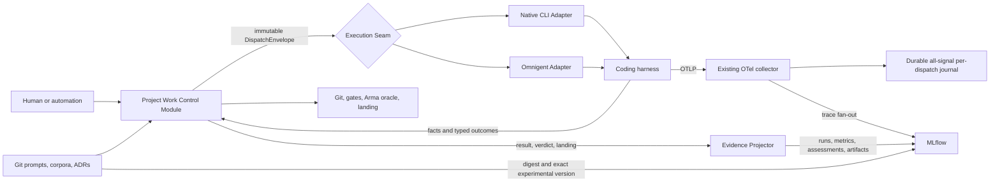

# Omnigent and MLflow: product boundaries, overlap, and adoption evidence

**Status:** Background technology-adoption assessment. No Omnigent adoption is authorized by
this document; [MVP specification #377](https://github.com/andrewesweet/arma-cti/issues/377)
governs the autonomous-development work. Its bounded-adoption recommendation is retained as a
separate research hypothesis, not a current implementation decision.

**Researched:** 2026-08-07

**External source snapshot:** Omnigent [`9f4c99c7`](https://github.com/omnigent-ai/omnigent/commit/9f4c99c7efe565d75b73b8430422d1b47551efde); MLflow [`08eb62e1`](https://github.com/mlflow/mlflow/commit/08eb62e14f22b9815f2d5d19df029658154638a5)

**Question:** What do Omnigent and MLflow each own, how do they overlap with the current and planned `arma-cti` system, and what should a best-of-breed adoption look like?

**Answer in one line:** Adopt both, but not as a replacement stack: use Omnigent as a bounded execution/session Adapter and MLflow as a rebuildable experiment/evaluation projection, while the repository remains authoritative for dispatch policy, subscription economics, Git/worktree/landing semantics, raw evidence, and deterministic Arma gates.

**Decision:** The inclination to prefer maintained products over new commodity home-grown infrastructure is correct. The proposed replacement criterion is not. Non-trivial feature overlap is insufficient when the products implement different semantics or failure modes. The rule should be: **prefer the external product at a commodity Seam when it can remove local Implementation without moving or weakening a project invariant.**

## 1. Method and limits

This report uses primary sources only for product claims: the official product sites, official documentation, and the two official GitHub repositories. Source-level statements are pinned to the commits above; public documentation links are the current pages inspected on the research date. The latest tagged GitHub releases at that point were [Omnigent v0.8.1](https://github.com/omnigent-ai/omnigent/releases/tag/v0.8.1) and [MLflow v3.15.1](https://github.com/mlflow/mlflow/releases/tag/v3.15.1). A separately installed Omnigent Python distribution reported `0.8.2`; §10.4 keeps those evidence sets distinct.

Two recent repository notes were used as leads and cross-checks: [Omnigent dispatch-platform analysis](./omnigent-dispatch-platform-analysis.md) and [Claude/Codex/MLflow observability gap analysis](./claude-codex-mlflow-observability-gap-analysis.md). Their decision-changing claims were checked against current product sources, repository code, live local state where applicable, and the originating threads.

Evidence terms:

- **Fact** means an official document or pinned source states or implements it.
- **Observed** means a repository or live local-state check established it on the research date.
- **Inference** means an architectural conclusion drawn from those facts and needing a pilot.

The product research was then reconciled with the repository, current GitHub Issues, and four recent project threads. Repository links are to the audited checkout; issue links are to the live plan as inspected on the research date. Sections 8 onward contain the integrated build-versus-buy decision.

## 2. Executive comparison

| Dimension | Omnigent | MLflow | Relationship |
|---|---|---|---|
| Primary job | Run, supervise, sandbox, govern, persist, share, and resume agent sessions across coding harnesses and custom agents. ([overview](https://omnigent.ai/), [harnesses](https://omnigent.ai/docs/build/harnesses)) | Record and search runs/traces, evaluate systems, manage prompts/models, and optionally proxy model requests. ([tracing](https://mlflow.org/docs/latest/genai/tracing/), [evaluation](https://mlflow.org/docs/latest/genai/eval-monitor/), [architecture](https://mlflow.org/docs/latest/self-hosting/architecture/overview/)) | Complementary core purposes. |
| Runtime ownership | Owns the live session, runner, agent loop or native-TUI wrapper, tools, subagents, approval state, and workspace access. ([deployment](https://omnigent.ai/docs/deploy/overview), [harness modes](https://omnigent.ai/docs/build/harnesses)) | Does not provide a coding-harness/session supervisor. Its server receives tracking, tracing, registry, evaluation, and gateway requests. ([tracking server](https://mlflow.org/docs/latest/self-hosting/architecture/tracking-server/)) | Omnigent is the natural execution plane. |
| Evidence and analysis | Persists conversations/messages/tool calls; exports opt-in OpenTelemetry traces, metrics, and logs; shows session cost and history. ([deployment](https://omnigent.ai/docs/deploy/overview), [telemetry source](https://github.com/omnigent-ai/omnigent/blob/9f4c99c7efe565d75b73b8430422d1b47551efde/omnigent/runtime/telemetry.py)) | Purpose-built trace/run store, search UI, dashboards, datasets, feedback, scorers, evaluation comparisons, registries, retention and archival. Its documented OTLP ingest endpoint is for traces. ([tracing](https://mlflow.org/docs/latest/genai/tracing/), [OpenTelemetry ingest](https://mlflow.org/docs/latest/genai/tracing/app-instrumentation/opentelemetry/), [evaluation](https://mlflow.org/docs/latest/genai/eval-monitor/)) | MLflow should normally own generic trace/evaluation views; Omnigent still owns operational session state, and a general telemetry backend may still be needed for metrics/logs. |
| Routing | Chooses a harness/model from the first message and keeps it for the session; can use a built-in judge or external `routes:select` service. ([Smart Routing](https://omnigent.ai/docs/build/routing)) | AI Gateway splits request traffic by weights and tries ordered model fallbacks. ([traffic routing](https://mlflow.org/docs/latest/genai/governance/ai-gateway/traffic-routing-fallbacks/)) | Different levels, but model choice overlaps and can conflict. |
| Spend control | Stateful policies can ASK or DENY using per-session, subagent-subtree, or per-user-daily cumulative cost. ([built-in policies](https://omnigent.ai/docs/policies/builtin)) | AI Gateway budgets alert or reject subsequent requests over USD thresholds on daily/weekly/monthly windows; distributed enforcement needs Redis. ([budgets](https://mlflow.org/docs/latest/genai/governance/ai-gateway/budget-alerts-limits/)) | Real duplication. Pick one hard-limit authority per lane. |
| Safety/governance | Tool and LLM-request policies, human approvals, loop/thrash detection, connector restrictions, OS sandbox, egress allow-list, credential proxy. ([policies](https://omnigent.ai/docs/policies/overview), [sandbox](https://omnigent.ai/docs/policies/os-sandbox)) | Gateway key centralization, request/response guardrails, endpoint RBAC, budgets, audit/usage traces. ([AI Gateway](https://mlflow.org/docs/latest/genai/governance/ai-gateway/), [RBAC](https://mlflow.org/docs/latest/self-hosting/security/role-based-access-control/)) | Complementary if Omnigent owns actions and MLflow owns model-I/O governance; duplicated for PII and budgets. |
| Extensibility | YAML agents, skills, MCP, ACP, Python/CEL policies, direct/headless harness plugins, custom sandbox providers. Native-TUI community harnesses are not yet pluggable. ([harnesses](https://omnigent.ai/docs/build/harnesses), [custom policies](https://omnigent.ai/docs/policies/custom)) | Python entry-point plugins for stores, auth, run context, evaluators, project backends, deployments and workspaces; manual/automatic tracing and custom scorers. ([plugins](https://mlflow.org/docs/latest/ml/plugins/), [tracing](https://mlflow.org/docs/latest/genai/tracing/)) | Both are extensible at different seams. |
| Maturity | New, explicitly Alpha, current source `0.9.0.dev0`; public release `0.8.1`. ([package metadata](https://github.com/omnigent-ai/omnigent/blob/9f4c99c7efe565d75b73b8430422d1b47551efde/pyproject.toml), [FAQ](https://omnigent.ai/faq), [release](https://github.com/omnigent-ai/omnigent/releases/tag/v0.8.1)) | Began in 2018, current source classifies itself Production/Stable, public release `3.15.1`, with an explicit backward-compatibility policy. ([repository metadata](https://api.github.com/repos/mlflow/mlflow), [package metadata](https://github.com/mlflow/mlflow/blob/08eb62e14f22b9815f2d5d19df029658154638a5/pyproject.toml), [contributing](https://github.com/mlflow/mlflow/blob/08eb62e14f22b9815f2d5d19df029658154638a5/CONTRIBUTING.md)) | MLflow's core is far more mature; that does not make every recent GenAI/Gateway integration equally mature. |
| License/governance | Apache-2.0; authored by Databricks and presented as built by the Databricks AI team and Neon; contributions use a DCO. ([license](https://github.com/omnigent-ai/omnigent/blob/9f4c99c7efe565d75b73b8430422d1b47551efde/LICENSE), [package](https://github.com/omnigent-ai/omnigent/blob/9f4c99c7efe565d75b73b8430422d1b47551efde/pyproject.toml), [DCO](https://github.com/omnigent-ai/omnigent/blob/9f4c99c7efe565d75b73b8430422d1b47551efde/DCO)) | Apache-2.0; governed by a Technical Steering Committee and described by its docs as a Linux Foundation project; Databricks remains the package maintainer/copyright holder. ([license](https://github.com/mlflow/mlflow/blob/08eb62e14f22b9815f2d5d19df029658154638a5/LICENSE.txt), [governance](https://github.com/mlflow/mlflow/blob/08eb62e14f22b9815f2d5d19df029658154638a5/CONTRIBUTING.md#governance), [tracing overview](https://mlflow.org/docs/latest/genai/tracing/)) | Open licenses, but not independent vendor diversification: both are closely tied to Databricks. |

The strongest challenge to a simplistic “best of both breeds” framing is in the last row. The products have good technical complementarity and Databricks ecosystem alignment, but they are not code-level dependencies: Omnigent exports standard OTLP and MLflow is one compatible sink. The shared ecosystem lowers integration cost while creating some correlated roadmap/governance risk; it is not a clean two-vendor hedge.

## 3. Omnigent in detail

### 3.1 Scope and architecture

Omnigent describes itself as a meta-harness: a common layer over coding agents, custom agents, policies, sandboxing, and collaborative interfaces. Its three deployed components are:

1. a **server**, which persists conversations/messages/tool calls, stores artifacts and catalogs, proxies MCP with server-side policy enforcement, manages skills, and handles users;
2. a **runner**, which executes the harness and tools and streams events to the server over WebSocket; and
3. terminal, web, desktop, mobile, Slack, and REST **interfaces**, which talk to the server rather than directly to the runner.

These responsibilities and boundaries are documented in the [deployment architecture](https://omnigent.ai/docs/deploy/overview). A runner can execute on a registered laptop or in a managed/cloud sandbox; Kubernetes runner pods are per-session and ephemeral unless operators mount durable storage. ([deployment guide](https://omnigent.ai/docs/deploy/overview))

The server supports SQLite for demos/single-instance use and requires Postgres for multiple server instances; both use the same schema and migrations. ([database guide](https://omnigent.ai/docs/deploy/database)) The current implementation lazily maintains a harness subprocess per conversation and includes crash, orphan, terminal-state, and idle lifecycle handling. ([process manager](https://github.com/omnigent-ai/omnigent/blob/9f4c99c7efe565d75b73b8430422d1b47551efde/omnigent/runtime/harnesses/process_manager.py))

**Inference:** this is a substantial operational product, not a small adapter library. Adopting it means accepting a second stateful service and database, plus runner lifecycle, upgrades, backups, authentication, and sandbox configuration.

### 3.2 Harness uniformity has three different semantics

Omnigent supports direct and native-TUI variants for many coding agents, plus generic Agent Client Protocol agents. In direct mode Omnigent drives the model and tools; in native mode it launches and mirrors the vendor TUI; an ACP agent owns its own loop, authentication, tools, and context while Omnigent renders the stream and can lend MCP tools. ([harness documentation](https://omnigent.ai/docs/build/harnesses))

That distinction limits the strength of the “swap one line” promise. Configuration syntax can remain uniform while approval behavior, resume semantics, token accounting, model overrides, tool visibility, cancellation, and policy coverage differ by harness mode. The generic ACP path even defaults to no sandbox when an agent needs to write its own configuration. ([harness documentation](https://omnigent.ai/docs/build/harnesses))

**Inference:** every direct/native/ACP mode intended for production needs its own conformance suite. A common UI and YAML schema are not proof of behavioral substitutability.

### 3.3 Policies and sandboxing are the strongest unique capability

Contextual policies intercept tool calls, LLM requests, and file operations, maintain state across a session, and return ALLOW, ASK, or DENY. Policies can be applied at session, agent-config, or server scope, with built-ins for cost, rate/tool limits, PII, model routing, connector access, loop/thrash detection, blast radius, fan-out bounds, and worktree confinement; custom Python functions or CEL rules extend the registry. ([policy overview](https://omnigent.ai/docs/policies/overview), [built-ins](https://omnigent.ai/docs/policies/builtin), [custom policies](https://omnigent.ai/docs/policies/custom))

Omnibox uses Linux bubblewrap or macOS Seatbelt, makes the working directory read-only by default on hardened backends, supports explicit read/write grants, default-deny HTTP(S) egress rules, private/metadata-address blocking, deny-by-default environment inheritance, and a credential proxy that injects real secrets outside the sandbox. If a requested hardened backend is unavailable, startup fails instead of silently dropping isolation. ([sandbox documentation](https://omnigent.ai/docs/policies/os-sandbox))

Its security boundary is explicitly incomplete:

- MCP subprocesses and the Omnigent supervisor process run outside the OS sandbox.
- Dotfile masking is top-level only unless recursive scanning is enabled, so a nested `.env` remains visible by default.
- Generic ACP agents may require `sandbox: none` to write their configuration.
- Native Windows operation has process-tree containment but no filesystem/network sandbox equivalent.

These are documented constraints, not hypothetical attacks. ([sandbox documentation](https://omnigent.ai/docs/policies/os-sandbox), [installation/platform notes](https://github.com/omnigent-ai/omnigent#quick-start))

Authentication supports local accounts, native OIDC, and trusted-header mode. However, the first-admin endpoint is intentionally unauthenticated until setup; public sharing is enabled by default; and unrecognized sharing configuration fails open to sharing enabled. ([authentication and sharing](https://omnigent.ai/docs/collaborate/auth)) **Inference:** a hardened deployment needs explicit bootstrapped admin credentials, private initial exposure, sharing disabled or restricted by policy, and a threat review of MCP and supervisor processes.

### 3.4 Routing is session classification, not resource scheduling

Smart Routing chooses one offered `(harness, model)` pair from the first message and applies it for the rest of the session. It can call an LLM judge or an external versioned `POST /routes:select` API; the prompt is truncated to 4,000 characters, and invalid or failed choices degrade to the default harness rather than blocking the session. ([Smart Routing](https://omnigent.ai/docs/build/routing))

This is a useful task-classification seam. It is not, by itself, documented as a dependency-DAG scheduler, host-slot allocator, subscription-quota controller, gate-outcome learner, or project workflow state machine.

**Inference:** it can replace simple harness/model classification, but it should not be assumed to replace deterministic project orchestration or resource admission without direct tests.

### 3.5 Extensibility

Direct/headless harnesses can ship as separate Python packages using the `omnigent.community.harness` entry-point group; they then appear in YAML, CLI, and UI. Native-TUI community harnesses are explicitly not pluggable yet. ([community harness contract](https://omnigent.ai/docs/build/harnesses)) Generic ACP is a lower-coupling route for an existing external agent. Custom policies are ordinary registered Python modules, and custom sandbox providers have a separate plugin contract. ([custom policies](https://omnigent.ai/docs/policies/custom), [sandbox provider contract](https://github.com/omnigent-ai/omnigent/blob/9f4c99c7efe565d75b73b8430422d1b47551efde/docs/extending/sandbox_providers.md))

The extensibility is real, but its most valuable use here is likely thin integration: project identity, policy decisions, and evidence correlation. Reimplementing the repository's entire control plane as an Omnigent plugin would merely move home-grown logic into another process.

### 3.6 MLflow is a documented OTLP destination, not an Omnigent dependency

Omnigent's current telemetry implementation uses the OpenTelemetry SDK directly and does not depend on MLflow. It can export to any compatible OTLP backend. ([telemetry source](https://github.com/omnigent-ai/omnigent/blob/9f4c99c7efe565d75b73b8430422d1b47551efde/omnigent/runtime/telemetry.py)) Its Databricks deployment guide documents one supported composition—Omnigent execution, an AI Gateway, and MLflow Tracing—and describes MLflow as the long-term trace store for that deployment. ([Databricks integration guide](https://github.com/omnigent-ai/omnigent/blob/9f4c99c7efe565d75b73b8430422d1b47551efde/docs/databricks.md)) MLflow's server independently exposes an OTLP `/v1/traces` endpoint for arbitrary OpenTelemetry clients. ([MLflow OpenTelemetry ingestion](https://mlflow.org/docs/latest/genai/tracing/app-instrumentation/opentelemetry/))

The signal boundary is important. Omnigent's current initialization code supports OTLP traces, metrics, and logs, whereas MLflow documents OTLP ingestion at `/v1/traces`. ([Omnigent telemetry source](https://github.com/omnigent-ai/omnigent/blob/9f4c99c7efe565d75b73b8430422d1b47551efde/omnigent/runtime/telemetry.py#L1086-L1148), [MLflow OTLP endpoint](https://mlflow.org/docs/latest/genai/tracing/app-instrumentation/opentelemetry/)) **Inference:** MLflow can replace a bespoke trace database/UI, but it is not by itself a general metrics-and-logs backend; retain an OTel collector or another compatible sink if those signals matter.

No bespoke trace bridge is therefore required in principle. There is, however, a current documentation/source discrepancy worth testing: Omnigent's telemetry source makes `OMNIGENT_TELEMETRY_ENABLED` a master opt-in that is off by default, while the Databricks guide's setup snippet lists the OTLP variables but omits that flag. ([telemetry source](https://github.com/omnigent-ai/omnigent/blob/9f4c99c7efe565d75b73b8430422d1b47551efde/omnigent/runtime/telemetry.py#L100-L114), [guide setup](https://github.com/omnigent-ai/omnigent/blob/9f4c99c7efe565d75b73b8430422d1b47551efde/docs/databricks.md#L481-L511)) Content capture is separately off by default and shallow-redacted/capped when enabled. ([telemetry source](https://github.com/omnigent-ai/omnigent/blob/9f4c99c7efe565d75b73b8430422d1b47551efde/omnigent/runtime/telemetry.py#L86-L129))

### 3.7 Maturity and governance risk

Omnigent's public site calls the project Alpha, its current package metadata is `0.9.0.dev0` with the Alpha classifier, and the repository was created on 2026-06-11. ([site](https://omnigent.ai/), [package](https://github.com/omnigent-ai/omnigent/blob/9f4c99c7efe565d75b73b8430422d1b47551efde/pyproject.toml), [GitHub metadata](https://api.github.com/repos/omnigent-ai/omnigent)) The v0.8 changelog contains breaking changes and fixes in high-risk seams such as first-message delivery, policy bypass, credential exposure, native subagent completion, sandbox behavior, session resume, and cost attribution. ([changelog](https://github.com/omnigent-ai/omnigent/blob/9f4c99c7efe565d75b73b8430422d1b47551efde/CHANGELOG.md))

That is normal for an ambitious Alpha, but it is decisive adoption evidence. The project is Apache-2.0 and accepts DCO-governed contributions, which limits legal lock-in; operational and API churn remain. ([license](https://github.com/omnigent-ai/omnigent/blob/9f4c99c7efe565d75b73b8430422d1b47551efde/LICENSE), [contributing](https://github.com/omnigent-ai/omnigent/blob/9f4c99c7efe565d75b73b8430422d1b47551efde/CONTRIBUTING.md), [DCO](https://github.com/omnigent-ai/omnigent/blob/9f4c99c7efe565d75b73b8430422d1b47551efde/DCO))

**Platform-level conclusion:** Omnigent is credible as a bounded execution surface and integration target now; its Alpha status argues against making it the sole, irreversible home of project workflow invariants before a shadow-mode pilot and rollback plan.

## 4. MLflow in detail

### 4.1 Scope and architecture

MLflow's architecture separates:

1. language SDKs;
2. a backend store for run, experiment, trace, model, prompt, and tag metadata;
3. an artifact store for large files; and
4. an optional FastAPI tracking server that exposes REST APIs and the UI.

Local use can write directly to SQLite and local files; team deployment normally uses the tracking server with a SQL backend and optionally object storage. Supported SQL backends include SQLite, PostgreSQL, MySQL, and MSSQL; artifact stores include local/NFS and major object-storage services. ([architecture](https://mlflow.org/docs/latest/self-hosting/architecture/overview/), [backend stores](https://mlflow.org/docs/latest/self-hosting/architecture/backend-store/), [artifact stores](https://mlflow.org/docs/latest/self-hosting/architecture/artifact-store/))

MLflow is therefore a durable evidence and lifecycle platform, not an agent execution environment. Its “Project Backend” plugin is a generic execution extension point, but the product does not supply Omnigent's live coding session, harness, subagent, approval, terminal, or OS-sandbox semantics. ([plugin types](https://mlflow.org/docs/latest/ml/plugins/))

### 4.2 Tracking, tracing, and coding-agent integrations

MLflow Tracing stores hierarchical inputs, outputs, metadata, latency, tokens, costs, feedback, and quality assessments, and is OpenTelemetry-compatible. It supports automatic integrations, manual spans, sampling, masking, distributed context, and production async logging. ([tracing overview](https://mlflow.org/docs/latest/genai/tracing/), [OpenTelemetry](https://mlflow.org/docs/latest/genai/tracing/app-instrumentation/opentelemetry/))

The Claude Code integration uses hooks/plugin setup and records prompts, responses, tools, nested subagents, skills, per-call/session tokens/cost, timing, and session metadata; its trace is exported when the Claude session ends. ([Claude Code tracing source](https://github.com/mlflow/mlflow/blob/08eb62e14f22b9815f2d5d19df029658154638a5/docs/docs/genai/tracing/integrations/listing/claude_code.mdx)) The Codex integration uses a Node `notify` hook after each turn, optionally reads the JSONL rollout to reconstruct tools/tokens, and emits an AGENT root with LLM/TOOL children; native Codex OTLP traces are described as internal operational detail rather than clean conversation flow. ([Codex tracing](https://mlflow.org/docs/latest/genai/tracing/integrations/listing/codex/))

The asymmetry matters:

- Claude is session-oriented and explicitly documents nested subagents and skills.
- Codex is turn-oriented and its documented capture set is smaller.
- Claude traces appear only after session end; Codex traces appear after each turn.
- Codex cost uses API pricing and explicitly may not represent subscription-plan spend.

Those are first-party documented differences, so “MLflow gives vendor parity” would be too strong. It gives a common store and broadly common shape, not identical signal semantics. ([Claude integration source](https://github.com/mlflow/mlflow/blob/08eb62e14f22b9815f2d5d19df029658154638a5/docs/docs/genai/tracing/integrations/listing/claude_code.mdx), [Codex integration](https://mlflow.org/docs/latest/genai/tracing/integrations/listing/codex/))

### 4.3 Evaluation, prompt, and model lifecycle

MLflow evaluation combines datasets, predict functions or existing traces, and code/LLM scorers, storing row-level results and comparisons in experiments. It also supports feedback/assessments and production monitoring. ([evaluation overview](https://mlflow.org/docs/latest/genai/eval-monitor/)) Prompt Registry provides immutable versions, diffs, aliases, metadata, lineage to tracing/evaluation, and reusable text/chat/Jinja templates. ([Prompt Registry](https://mlflow.org/docs/latest/genai/prompt-registry/)) Model Registry supplies model versions, aliases, tags, annotations, and lineage back to runs. ([Model Registry](https://mlflow.org/docs/latest/ml/model-registry/))

These are product surfaces that would be costly to reproduce. They do not determine whether a coding change is correct, whether a Git landing is valid, or whether an Arma in-world oracle passed; they store, compare, and present those results once a project-specific adapter supplies them.

**Inference:** MLflow should be an analytical projection of domain truth, not the mechanism that invents domain outcomes.

### 4.4 AI Gateway overlaps materially with Omnigent

MLflow AI Gateway centralizes provider endpoints and keys, records usage/traces, supports passthrough provider formats, weighted traffic splitting, ordered fallbacks, request/response guardrails, RBAC, and budget policies. ([AI Gateway](https://mlflow.org/docs/latest/genai/governance/ai-gateway/), [routing and fallbacks](https://mlflow.org/docs/latest/genai/governance/ai-gateway/traffic-routing-fallbacks/), [budgets](https://mlflow.org/docs/latest/genai/governance/ai-gateway/budget-alerts-limits/))

Its routing semantics differ from Omnigent's. Omnigent selects a harness/model once from task context. MLflow distributes individual model requests by weights and then tries ordered fallbacks. The Gateway documentation does not promise session-sticky weighted routing. ([Omnigent routing](https://omnigent.ai/docs/build/routing), [MLflow routing](https://mlflow.org/docs/latest/genai/governance/ai-gateway/traffic-routing-fallbacks/))

**Inference:** weighted request-level A/B routing under a stateful coding conversation could switch models within a session and confound both behavior and attribution. For coding-agent lanes, use a fixed primary plus explicit failovers until stickiness and transcript compatibility are proven.

Authentication is also lane-specific:

- MLflow documents Claude Code proxying through the Gateway while the developer keeps existing Anthropic credentials. ([Claude Code Gateway](https://mlflow.org/docs/latest/genai/governance/ai-gateway/coding-agents/claude-code/))
- The Codex Gateway page's description says “subscription,” but the instructions explicitly say an API key is required instead of a ChatGPT subscription. ([Codex Gateway](https://mlflow.org/docs/latest/genai/governance/ai-gateway/coding-agents/codex/))
- Omnigent distinguishes official-CLI subscription credentials from API-key and compatible-gateway credentials. ([models and credentials](https://omnigent.ai/docs/build/models))

That documentation inconsistency and lane asymmetry make Gateway insertion a per-lane pilot decision, not a universal part of “adopt MLflow.” Tracing/evaluation can be adopted without proxying model traffic at all.

### 4.5 Deployment, retention, and security

A local server defaults to SQLite and local `mlartifacts`; production can use Postgres/MySQL and object storage. The server can proxy artifact access, which means users inherit the server's access to every artifact reachable by its assumed role. ([tracking server](https://mlflow.org/docs/latest/self-hosting/architecture/tracking-server/), [artifact access warning](https://mlflow.org/docs/latest/self-hosting/architecture/artifact-store/#managing-artifact-store-access)) Trace payloads can be archived to artifact storage while remaining visible through the UI/API. ([trace archival](https://mlflow.org/docs/latest/self-hosting/architecture/tracking-server/#trace-archival))

Runs and artifacts are soft-deleted by default and permanently removed by `mlflow gc`; MLflow is not an immutable or append-only audit ledger. ([backend deletion behavior](https://mlflow.org/docs/latest/self-hosting/architecture/backend-store/#deletion-behavior), [artifact deletion behavior](https://mlflow.org/docs/latest/self-hosting/architecture/artifact-store/#deletion-behavior))

OSS MLflow has built-in username/password authentication and RBAC; current RBAC dates from MLflow 3.13 and supports experiments, models, prompts, scorers, workspaces, and Gateway resources. Its permission resolver has no explicit-deny override and defaults to a READ floor unless configured otherwise. ([basic auth](https://mlflow.org/docs/latest/self-hosting/security/basic-http-auth/), [RBAC](https://mlflow.org/docs/latest/self-hosting/security/role-based-access-control/)) OIDC is provided by a community-maintained plugin or an external reverse proxy, rather than the core server. ([SSO documentation](https://mlflow.org/docs/latest/self-hosting/security/sso/))

**Inference:** a shared deployment needs an explicit auth/RBAC configuration review; “MLflow has RBAC” is not equivalent to secure-by-default project isolation.

AI Gateway budget enforcement has another deployment trap: its local budget tracker is process-local and can exceed the configured total across workers/replicas; Redis is required for atomic global state. ([budget tracker strategies](https://mlflow.org/docs/latest/genai/governance/ai-gateway/budget-alerts-limits/#budget-tracker-strategies))

### 4.6 Extensibility and governance

MLflow's Python entry-point plugins cover tracking/artifact/model-registry stores, auth and request headers, run context, project execution backends, evaluators, deployments, and workspaces. ([plugin architecture](https://mlflow.org/docs/latest/ml/plugins/)) Custom code and LLM scorers extend evaluation, and arbitrary OpenTelemetry instrumentation can post to `/v1/traces`. ([evaluation](https://mlflow.org/docs/latest/genai/eval-monitor/), [OpenTelemetry ingestion](https://mlflow.org/docs/latest/genai/tracing/app-instrumentation/opentelemetry/))

The project is Apache-2.0, governed by a named Technical Steering Committee under a technical charter, and maintains a documented backward-compatibility policy. ([license](https://github.com/mlflow/mlflow/blob/08eb62e14f22b9815f2d5d19df029658154638a5/LICENSE.txt), [governance and compatibility](https://github.com/mlflow/mlflow/blob/08eb62e14f22b9815f2d5d19df029658154638a5/CONTRIBUTING.md)) The package marks itself Production/Stable and the repository dates to 2018. ([package](https://github.com/mlflow/mlflow/blob/08eb62e14f22b9815f2d5d19df029658154638a5/pyproject.toml), [repository metadata](https://api.github.com/repos/mlflow/mlflow))

The caution is scope-specific maturity: coding-CLI integrations, the newer RBAC surface, Gateway budgets, and fast-moving GenAI evaluation APIs are much younger than Tracking. Core MLflow's age lowers—but does not erase—adoption risk for those newer modules.

## 5. Where the two products complement or duplicate one another

### 5.1 Recommended ownership boundary at product level

| Concern | Primary owner | Secondary/integration role | Guard against |
|---|---|---|---|
| Live conversation, resume, steering, approvals, terminals, subagents | Omnigent | MLflow receives correlated traces | Treating a trace as resumable session state. |
| Harness/session lifecycle | Omnigent behind the project Execution Seam | Project assigns and verifies worktree identity; MLflow records environment | Letting a harness manager choose dispatch eligibility or weaken linked-worktree semantics. |
| Tool/action authorization and blast radius | Project permission contract, enforced by the selected harness/Omnigent sandbox | MLflow records decisions/outcomes | Depending on model-I/O guardrails to constrain shell/files, or silently broadening the local contract. |
| Trace search, dashboards, evaluation datasets, scorers, feedback | MLflow | Omnigent emits OTLP and session identity | Building another generic trace/eval UI in project code. |
| General operational metrics and logs | Existing OTel collector and durable export | Omnigent emits them; MLflow traces carry correlation | Assuming MLflow's `/v1/traces` endpoint stores every OTel signal. |
| Domain correctness and acceptance gates | Project | Mirror outcome into MLflow; expose it to Omnigent policy only when useful | Replacing deterministic oracles with LLM judges. |
| Task-to-harness choice | Project controller initially | Omnigent receives the explicit choice; MLflow records decision/outcome | Letting two classifiers race or silently override one another. |
| Provider endpoint failover | Existing explicit lane/breaker policy initially | Gateway is a later per-lane option | Weighted per-request model switching inside stateful sessions. |
| Hard spend/quota admission | Project breaker/admission | Omnigent and MLflow observe or soft-warn | Two disagreeing USD counters, duplicate rejection, and false subscription cost. |
| Prompt/skill source | Git for production; exact MLflow versions for experimental prompts only | Omnigent loads production material; MLflow records commit/digest | Two editable canonical copies of the same prompt. |
| Raw audit evidence | Existing per-dispatch all-signal OTel export, dispatch files, and Git | MLflow is searchable projection; Omnigent stores live session state | Assuming soft-deletable MLflow state is append-only evidence. |

### 5.2 The main duplicate-control hazards

#### Routing

Omnigent's routing is semantic and session-scoped; MLflow's is traffic/request-scoped. Both may ultimately choose a model. If both are enabled without a contract, the recorded Omnigent choice need not equal the model that actually served a later request. Use Omnigent for harness/task classification and a fixed MLflow endpoint with explicit failovers, or delegate model choice entirely to the Gateway and record the resolved model—do not claim both are authoritative. ([Omnigent routing](https://omnigent.ai/docs/build/routing), [MLflow routing](https://mlflow.org/docs/latest/genai/governance/ai-gateway/traffic-routing-fallbacks/))

#### Budgets and cost

Omnigent can pause for human approval and scopes cost to a session, child subtree, or user/day. MLflow Gateway alerts or returns HTTP 429 by recurring USD window and needs Redis for global multi-worker enforcement. Subscription-backed coding agents further break the assumption that API list price equals actual spend. ([Omnigent cost policies](https://omnigent.ai/docs/policies/builtin#cost-control), [MLflow budgets](https://mlflow.org/docs/latest/genai/governance/ai-gateway/budget-alerts-limits/), [Codex cost warning](https://mlflow.org/docs/latest/genai/tracing/integrations/listing/codex/#token-usage-and-cost))

Use one system for hard admission and make the other observational or soft-warning only. A quota window, a subscription seat, and an API-dollar budget are distinct resources and should not be collapsed into one counter.

#### Privacy and content retention

Omnigent's OTLP content capture is off by default. MLflow's coding-CLI integrations intentionally capture prompts, assistant responses, and tool inputs/outputs because those are what its trace UI evaluates. ([Omnigent telemetry privacy](https://github.com/omnigent-ai/omnigent/blob/9f4c99c7efe565d75b73b8430422d1b47551efde/omnigent/runtime/telemetry.py#L86-L129), [Claude capture source](https://github.com/mlflow/mlflow/blob/08eb62e14f22b9815f2d5d19df029658154638a5/docs/docs/genai/tracing/integrations/listing/claude_code.mdx), [Codex capture](https://mlflow.org/docs/latest/genai/tracing/integrations/listing/codex/))

The combined default is therefore not self-evident. A pilot must decide whether MLflow receives structural Omnigent spans only, rich CLI traces, or both; define redaction and retention; and test whether tool outputs expose source, secrets, issue text, or credentials.

#### Identity and storage

Both products have users, databases, artifacts, projects/workspaces, and access controls, but those entities mean different things. Omnigent's artifacts and database support a live, shareable agent session; MLflow's support experiments, traces, models, prompts, and analytical artifacts. ([Omnigent deployment](https://omnigent.ai/docs/deploy/overview), [MLflow architecture](https://mlflow.org/docs/latest/self-hosting/architecture/overview/))

Using OIDC for both does not create shared authorization semantics. Define a correlation contract (`dispatch_id`, repository, issue, commit, session, trace, experiment, lane, model) rather than trying to merge the databases.

## 6. A coherent combined architecture hypothesis

The externally supported integration path is:

```text
human / automation
        |
        v
Omnigent server ---- persistent live session, policy, sharing
        |
        v
Omnigent runner ---- harness / tools / sandbox / subagents
        |  \
        |   \-- OTLP traces -------------------------> MLflow Tracking
        |                                              runs / traces / search
        |                                              datasets / scorers / feedback
        |
        \-- model request --> optional MLflow Gateway --> provider
                               fixed endpoint/fallbacks

project dispatch + deterministic gates ----------------> MLflow run tags,
                                                         metrics, assessments,
                                                         and artifacts
```

This is an **inference**, but every product-to-product arrow has a documented seam: Omnigent emits OTLP, MLflow ingests OTLP, MLflow exposes coding-agent/gateway endpoints, and both expose APIs/plugin mechanisms. ([Omnigent MLflow guide](https://github.com/omnigent-ai/omnigent/blob/9f4c99c7efe565d75b73b8430422d1b47551efde/docs/databricks.md), [MLflow OTLP](https://mlflow.org/docs/latest/genai/tracing/app-instrumentation/opentelemetry/), [Omnigent plugins](https://omnigent.ai/docs/build/harnesses), [MLflow plugins](https://mlflow.org/docs/latest/ml/plugins/))

The optional Gateway is deliberately drawn as optional. MLflow Tracking/Evaluation offers value without changing authentication or the model request path, whereas the Gateway changes failure, cost, credential, and model-selection semantics.

## 7. Risks that should be explicit in any adoption decision

| Risk | Evidence | Required proof before relying on it |
|---|---|---|
| Omnigent API/behavior churn | Alpha classifier, `0.9.0.dev0`, recent critical bug fixes and breaking changes. ([package](https://github.com/omnigent-ai/omnigent/blob/9f4c99c7efe565d75b73b8430422d1b47551efde/pyproject.toml), [changelog](https://github.com/omnigent-ai/omnigent/blob/9f4c99c7efe565d75b73b8430422d1b47551efde/CHANGELOG.md)) | Pin version; replay representative sessions; prove rollback/export; run direct/native conformance tests. |
| False harness parity | Direct, native, and ACP place ownership in different processes. ([harnesses](https://omnigent.ai/docs/build/harnesses)) | Test resume, cancellation, approval, model override, usage, subagents, failures, and policy coverage per mode. |
| Sandbox overconfidence | MCP and supervisor outside sandbox; nested dotfiles visible by default; Windows degraded. ([sandbox](https://omnigent.ai/docs/policies/os-sandbox), [platform notes](https://github.com/omnigent-ai/omnigent#quick-start)) | Threat model and adversarial probes; explicitly configure recursive masking and MCP containment. |
| Public/auth defaults | Initial setup endpoint can be claimed; public sharing defaults on and unknown config fails open. ([auth](https://omnigent.ai/docs/collaborate/auth)) | Private bootstrap, preset admin, sharing off/restricted, auth and session-permission tests. |
| Telemetry configuration drift | Source requires a master opt-in omitted from a first-party deployment snippet. ([source](https://github.com/omnigent-ai/omnigent/blob/9f4c99c7efe565d75b73b8430422d1b47551efde/omnigent/runtime/telemetry.py#L100-L114), [guide](https://github.com/omnigent-ai/omnigent/blob/9f4c99c7efe565d75b73b8430422d1b47551efde/docs/databricks.md#L481-L511)) | End-to-end local OTLP test with expected trace/span/session identifiers and loss behavior. |
| MLflow operational footprint | Tracking server, SQL store, artifacts, migrations/backups; Redis for global Gateway budget. ([architecture](https://mlflow.org/docs/latest/self-hosting/architecture/overview/), [budgets](https://mlflow.org/docs/latest/genai/governance/ai-gateway/budget-alerts-limits/)) | Deployment/backup/restore rehearsal and measured laptop/CI overhead. |
| MLflow not immutable audit | Soft delete plus permanent `mlflow gc`. ([deletion behavior](https://mlflow.org/docs/latest/self-hosting/architecture/backend-store/#deletion-behavior)) | Retain independently durable raw evidence if audit/reproducibility requires it. |
| CLI trace asymmetry and loss windows | Claude exports at session end; Codex exports per turn; captured structures differ. ([Claude source](https://github.com/mlflow/mlflow/blob/08eb62e14f22b9815f2d5d19df029658154638a5/docs/docs/genai/tracing/integrations/listing/claude_code.mdx), [Codex](https://mlflow.org/docs/latest/genai/tracing/integrations/listing/codex/)) | Crash/kill/restart tests and an explicit completeness marker per lane. |
| Cost lies for subscription lanes | Codex integration warns API-price cost may not equal subscription spend. ([Codex cost note](https://mlflow.org/docs/latest/genai/tracing/integrations/listing/codex/#token-usage-and-cost)) | Keep list-price estimate, actual spend, quota window, and capacity as separate fields. |
| Gateway breaks lane authentication | Codex Gateway needs API key rather than ChatGPT subscription; Claude behavior differs. ([Codex Gateway](https://mlflow.org/docs/latest/genai/governance/ai-gateway/coding-agents/codex/), [Claude Gateway](https://mlflow.org/docs/latest/genai/governance/ai-gateway/coding-agents/claude-code/)) | Pilot each exact CLI/version/credential type; do not generalize one lane's success. |
| Correlated ecosystem risk | Both projects are Databricks-associated and Omnigent documents a Databricks/MLflow composition, although the actual telemetry seam is vendor-neutral OTLP. ([Omnigent site](https://omnigent.ai/), [MLflow package](https://github.com/mlflow/mlflow/blob/08eb62e14f22b9815f2d5d19df029658154638a5/pyproject.toml), [Omnigent telemetry](https://github.com/omnigent-ai/omnigent/blob/9f4c99c7efe565d75b73b8430422d1b47551efde/omnigent/runtime/telemetry.py), [deployment guide](https://github.com/omnigent-ai/omnigent/blob/9f4c99c7efe565d75b73b8430422d1b47551efde/docs/databricks.md)) | Keep integrations standards-based (OTLP, REST, ACP/MCP), pinned, exportable, and replaceable. |

## 8. Existing `arma-cti` capabilities and sources of truth

The repository does not contain one generic orchestration product waiting to be replaced. It contains a functioning, evidence-driven work-control system plus Arma-specific acceptance machinery. Its generic catalog and analysis layer is comparatively thin.

### 8.1 Current ownership

| Concern | Current authoritative source | What is derived | External-platform decision |
|---|---|---|---|
| Dispatch identity and intent | `dispatch.json`, exact `brief.md`, and the six `cti.*` resource attributes minted by [`tools/dispatch.py`](../../tools/dispatch.py#L435) | `ledger.json`, OTel views, future MLflow run/trace | Keep the project ID authoritative; attach Omnigent and MLflow IDs to it. |
| Lane/profile selection | Opaque profiles and lane wiring in [`tools/dispatch.py`](../../tools/dispatch.py#L227) | Reports and experiment tags | Keep profile meaning local. Omnigent executes the chosen profile; it does not reinterpret it. |
| Dispatch eligibility | Queue policy, admission state, breaker state, and the ordered refusal ladder in [`tools/dispatch.py`](../../tools/dispatch.py#L1219) | Refusal logs and OTel transition events | Keep local and fail-closed. Neither product has equivalent issue, admission, subscription-window, and quality semantics. |
| Process execution facts | `result.json`, process log, return code, and worktree assertion in [`tools/dispatch.py`](../../tools/dispatch.py#L1411) | End-state classification | Split the launch mechanism behind an execution Interface; keep fact semantics local. |
| Raw operational evidence | Durable, append-only, per-dispatch all-signal OTel export; rotating capture is the degraded fallback | Materialized ledger and future MLflow projection | Keep as canonical audit evidence. Fan out traces to MLflow; do not replace the all-signal journal with a trace-only store. See [`docs/telemetry-ledger.md`](../telemetry-ledger.md#which-source-a-row-read-and-why-it-matters). |
| Usage and capacity economics | Raw provider signal plus project normalization in [`tools/ledger.py`](../../tools/ledger.py#L599) and breaker quota feeds | `cap_fraction`, list-price estimates, reports | Keep subscription capacity, observed quota, and API list price as separate local concepts. |
| Git landing and quality evidence | Git history, issue reference, `just land`, admission audit, repo gates, and typed Arma verdicts | Ledger gate outcome and MLflow assessment | Keep local. MLflow may store the verdict and artifacts but must not manufacture it. |
| Arma correctness | Regression slots, probes, pool merge, typed verdicts, independent/paste rules, and failure bundles documented in [`docs/regression-tier.md`](../regression-tier.md) | Summary comments, scores, dashboards | Keep the runner and oracle local; export exact typed results to MLflow. |
| Planner behaviour | Git-versioned deterministic utility scoring in [`src/cti_daemon/planner.py`](../../src/cti_daemon/planner.py#L159) | Decision traces and reports | Track experiments in MLflow. Do not adopt Model Registry/Serving until an actual learned artifact exists. |
| Campaign state | Live state and the planned versioned snapshot; completed records use [`src/cti_daemon/archive.py`](../../src/cti_daemon/archive.py#L51) | Telemetry is a flight recorder | Keep outside both platforms. A trace or MLflow artifact is not resumable game state. |
| Production instructions | `CLAUDE.md`, agents, skills, settings, generated exact briefs, ADRs, and Git history | Digests and experimental copies | Keep Git authoritative. Use Prompt Registry only for experimental prompts/rubrics and record exact versions. |

The distinction in the first two rows matters. A `dispatch_id` is the causal project identity. An Omnigent conversation/response ID and an MLflow run/trace ID are foreign keys, not competing primary keys.

### 8.2 What is genuinely commodity

These are good external-product targets because reproducing them locally would create shallow modules with large maintenance surfaces:

- persistent, shareable, resumable agent conversations and cross-device supervision;
- coding-harness discovery, common launch lifecycle, generic child sessions, and generic sandbox/credential brokering;
- run grouping, parent/child attempts, experiment arms, parameter and metric search, artifact indexing, comparison UI, retention, and dashboards;
- trace exploration, evaluation datasets, row-level scorer results, human feedback, and experimental prompt/version lineage;
- generic aggregate queries across lane, profile, issue, model, seed, map, economy version, and Git SHA.

The repository has evidence producers for all of these but not a generic experiment product: local files are fragmented, ledger materialization is manual, comparison/search is minimal, and there is no general evaluation or prompt UI. MLflow is the clearest place to stop future home-brew. Omnigent offers more replacement Leverage around session lifecycle and user interfaces, though its first integration adds more infrastructure than it immediately deletes.

### 8.3 What only looks generic

The following mechanisms have familiar names but project-specific semantics:

- `queue` means GitHub readiness, freeze, WIP, packages, reservations, surfaces, and live dispatches;
- `admission` is a preregistered human ruling over evidence windows, not a generic score threshold;
- `breaker` combines provider availability, first-party quota evidence, profile quality, explicit reset rules, and typed non-results;
- `budget` means subscription-window capacity as well as API-price estimates;
- `success` means a SHA-bound landing and, where owed, a deterministic in-world verdict—not a zero process exit;
- `recovery` reconstructs issue, dispatch, worktree, landing, watch, and evidence state rather than merely resuming a chat;
- `prompt` includes governed production instructions and generated briefs, not only a mutable LLM template.

Moving these rules into an Omnigent policy plugin or MLflow scorer would not remove home-grown logic. It would move it farther from its data and weaken Locality.

### 8.4 Truth defects to repair before migration

An analytical product will make existing facts easier to query; it will not make weak attribution correct. The audit found six issues to settle before using MLflow results for routing or promotion:

1. **Landing attribution is inferred, not explicit.** [`ledger.landed`](../../tools/ledger.py#L875) can credit the same eventual issue landing to two paired runs with the same base and time window. Add an immutable dispatch-to-landing relation, such as a landing record or commit trailer, before paired experiments.
2. **Quality-breaker feedback is incomplete.** `gate_failed` exists as a breaker outcome, but normal dispatch classification does not derive it from ledger/admission gate evidence. Do not treat today’s quality trip rate as complete.
3. **Registry duplication has drifted.** Lane/profile/seat knowledge appears in dispatcher, admission, ledger, and breaker; the audited breaker default omitted the Codex lane registered by dispatch. Consolidate the registry or add cross-module contract tests.
4. **Ledger coverage is manual.** The recent observability thread found 25 durable dispatch exports but only six materialized rows; the later repository audit saw the same six rows against a larger dispatch inventory. Automate materialization or make completeness explicit.
5. **Green-but-unlanded work is invisible to positive gate accounting.** The current ledger correctly refuses to infer a gate pass from process exit, but that leaves successful unlanded gates unobserved. Preserve the caveat in every experiment.
6. **There is no model-artifact lifecycle today.** Coding profiles are hosted-agent configurations and the game planner is deterministic code. Model Registry and model serving would be anticipatory infrastructure.

## 9. Planned capabilities in GitHub Issues

The current plan makes the product boundary clearer than the existing code alone.

| Issue | Planned capability | Best fit | Recommendation |
|---|---|---|---|
| [#187](https://github.com/andrewesweet/arma-cti/issues/187) | Three-arm offline planner prototype across seeds, with efficacy and complexity measures | MLflow Tracking | Use as the first low-risk Tracking pilot: deterministic, offline, and free of provider-meter ambiguity. |
| [#237](https://github.com/andrewesweet/arma-cti/issues/237) | Multi-turn cache/plan-currency experiment | MLflow Tracking plus local meter | Use as the second pilot; MLflow compares arms while the project remains authoritative for cache and subscription economics. |
| [#262](https://github.com/andrewesweet/arma-cti/issues/262) | E1–E9 programme, including E3 decision replay and E4 authorship over dated ADR/retro corpora | MLflow datasets, evaluation, feedback, exact experimental prompt versions | This is the strongest MLflow adoption point. Keep corpus manifests/digests, contamination cuts, labels, and promotion rules in Git. |
| [#255](https://github.com/andrewesweet/arma-cti/issues/255) | Durable CLI/iOS human interlocutor | Omnigent sessions/mobile/collaboration | Reframe as the strongest user-facing Omnigent pilot instead of building a new session service and mobile surface. |
| [#179](https://github.com/andrewesweet/arma-cti/issues/179) | Unattended screenshot artifacts and possible human, vision, or pixel-diff verdict | MLflow artifacts/feedback; local capture/oracle | Store and review images in MLflow. Do not make a new multimodal judge a gate until false negatives are measured against the local oracle/humans. |
| [#5](https://github.com/andrewesweet/arma-cti/issues/5) | Acceptance harness and independent oracle with declarative specs and failure bundles | Local execution/oracle; MLflow catalog/evaluation view | Export cases, versions, typed verdicts, disagreements, timelines, and artifacts. Do not replace the Arma runner or independent oracle. |
| [#53](https://github.com/andrewesweet/arma-cti/issues/53) | Remote execution slots and evidence pullback | Possible Omnigent runner overlap | Investigate only after a local runner pilot; Arma host/slot/stale-process semantics remain project-owned. |
| [#234](https://github.com/andrewesweet/arma-cti/issues/234) | Herma/OpenAI-compatible lane with hooks, telemetry, ledger, balance, admission, and breaker | Omnigent can reduce harness plumbing | Treat harness launch as one criterion only. Omnigent does not discharge parity, accounting, or admission evidence. |
| [#261](https://github.com/andrewesweet/arma-cti/issues/261) | Binding provider limit and `retry-after` correctness | Local breaker | Do not replace with either product’s generic USD budget. |
| [#266](https://github.com/andrewesweet/arma-cti/issues/266) | Per-dispatch routing-policy refusal and fail-closed landing-diff enforcement | Local work-control policy | Omnigent Smart Routing is not equivalent: it classifies the first message and can fall back to a default. |
| [#265](https://github.com/andrewesweet/arma-cti/issues/265), [#273](https://github.com/andrewesweet/arma-cti/issues/273) | Codex linked-worktree/gate and real edit-hook parity defects | Adapter acceptance criteria | Block default Omnigent implementation dispatch until the selected harness mode passes these real semantics. |
| [#267](https://github.com/andrewesweet/arma-cti/issues/267) | Authoritative orchestration runbook | Local control-plane documentation | Document the stable Interface and authority map; do not restate two vendor manuals. |
| [#4](https://github.com/andrewesweet/arma-cti/issues/4) | Strategic snapshot persistence and resume fidelity | Local domain persistence | Keep outside Omnigent conversations and MLflow artifacts. |

Adjacent plans fit the same boundary. Continuation economics [#208](https://github.com/andrewesweet/arma-cti/issues/208), handoff break-even measurement [#212](https://github.com/andrewesweet/arma-cti/issues/212), and the time-boxed routing verdict [#258](https://github.com/andrewesweet/arma-cti/issues/258) are good MLflow comparison workloads whose meters and promotion decisions remain local. Orchestrator disentanglement [#242](https://github.com/andrewesweet/arma-cti/issues/242) should produce the Execution Seam rather than port the controller into Omnigent. Mutation-score work [#244](https://github.com/andrewesweet/arma-cti/issues/244) and [#246](https://github.com/andrewesweet/arma-cti/issues/246) may publish metrics/artifacts to MLflow, but remains repository test infrastructure. Telemetry correctness [#143](https://github.com/andrewesweet/arma-cti/issues/143) remains a prerequisite below any analytical projection.

The already delivered tranche—dispatcher [#223](https://github.com/andrewesweet/arma-cti/issues/223), admission [#224](https://github.com/andrewesweet/arma-cti/issues/224), breaker [#226](https://github.com/andrewesweet/arma-cti/issues/226), ledger [#227](https://github.com/andrewesweet/arma-cti/issues/227), prerequisites [#230](https://github.com/andrewesweet/arma-cti/issues/230), queue [#250](https://github.com/andrewesweet/arma-cti/issues/250), brief compiler [#251](https://github.com/andrewesweet/arma-cti/issues/251), admission audit [#252](https://github.com/andrewesweet/arma-cti/issues/252), and recovery [#253](https://github.com/andrewesweet/arma-cti/issues/253)—means this is a migration around a live control plane, not a greenfield platform choice.

## 10. Challenge to the proposed adoption intent

The intent is directionally right but too broad. Five tests expose the problem.

### 10.1 Feature overlap is not semantic substitutability

Omnigent has routing, budgets, policies, retries, worktree concepts, telemetry, and orchestration. MLflow has budgets, routing/fallbacks, prompts, tracing, evaluation, and registries. Those nouns overlap with the repo, but the units and failure semantics differ. A fail-open first-message classifier is not a fail-closed issue scheduler; a USD counter is not a subscription quota window; an LLM judge is not an independent Arma oracle; a resumable conversation is not issue/SHA recovery.

The replacement test should therefore be:

> Can the external capability preserve the project’s input, output, authority, refusal, durability, and recovery contract—and let local production Implementation be deleted?

If it only adds a second layer and a second database, it has not replaced anything.

### 10.2 The local system is deeper than it first appears

The current work-control Module has a relatively narrow operational Interface (`queue`, `brief`, `dispatch`, `watch`, `recover`, `land`, `verdict`, `ledger`) over a large Implementation of project rules. That is high Depth, not merely accidental plumbing. The shallow portion is concentrated inside harness-specific argv/environment/session handling and the missing generic experiment UI/catalog.

This reverses the intuitive ratio: MLflow can prevent substantial *future* home-brew in #187/#237/#262, but there is little existing MLflow-like UI/database code to delete. Omnigent can eventually shrink launch/session code, but its server, database, runner, auth, upgrades, and conformance suite initially add operational surface.

### 10.3 Three control planes are worse than one home-grown control plane

Enabling local routing/breakers, Omnigent Smart Routing/cost policies, and MLflow Gateway routing/budgets together would create three authorities. Their counters and selected models can disagree, and each may reject or fail over at a different level. The combined platform is safe only if most overlapping controls are deliberately disabled or observational.

### 10.4 Product maturity is capability-specific

MLflow Tracking is mature; its newer coding-agent, Gateway, Review Queue, multimodal judge, MCP Registry, and optimizer surfaces are not equally mature. Omnigent is explicitly Alpha. A recent live project thread tested the Python-distribution build reporting `0.8.2` and found three concrete compatibility problems: an overly strict OpenCode version cap despite a successful bridge probe, a Hermes semver/date comparison mismatch, and ignored Pi native credentials. Local isolated-install patches fixed them but may be overwritten by `omni upgrade`. The latest public GitHub release inspected was v0.8.1, while audited `main` identified as `0.9.0.dev0`; it was not established whether either fixes the installed-build defects.

This is not a rejection of Omnigent. It is evidence that an exact-version, exact-harness acceptance matrix and rollback path are part of the product, not temporary pilot paperwork.

### 10.5 The pair is not a vendor-diversification strategy

Both projects are Apache-2.0 and communicate over standards, which is favourable. Both are also closely associated with Databricks. Use their complementarity, but preserve OTLP, REST, Git, raw files, and thin Adapters so correlated roadmap changes do not become architectural lock-in.

## 11. Best-of-breed target architecture

The best result is not “Omnigent + MLflow instead of the repo.” It is **a project work-control kernel, two execution Adapters, and a rebuildable analysis projection**.



### 11.1 Work Control Module

This Module remains authoritative for issue eligibility, queue/WIP/package policy, opaque profiles, subscription economics, admission, breakers, worktree assignment, expected gates, typed non-results, landing, and Arma correctness. Its Interface should produce and consume facts; it should not know whether a particular Adapter uses a vendor CLI directly or Omnigent.

The immutable `DispatchEnvelope` should include at least:

```text
dispatch_id, attempt_id, parent_dispatch_id?, experiment_id?, arm?, pair_id?,
issue, repository, base_sha, lane, profile, seat, worktree_identity,
brief_sha256, corpus_sha256?, planned_charge, created_at
```

The completion record adds explicit `landing_sha?`, gate/verdict identity, end-state class, and foreign IDs (`omnigent_conversation_id`, `omnigent_response_id`, `mlflow_run_id`, `trace_id`). Foreign IDs never replace `dispatch_id`.

### 11.2 Execution Seam

Extract the harness-specific part of [`tools/dispatch.py`](../../tools/dispatch.py#L1127) behind a small Interface such as `launch`, `inspect`, `cancel`, and `resume`. Provide two real Adapters:

1. the current native CLI Adapter, reduced to the minimum direct-launch path; and
2. an Omnigent Adapter, initially with explicit harness/model/profile selection.

Two real implementations justify the Seam. The controller performs the refusal ladder and issues the envelope before either Adapter is called. An Adapter may report `unavailable`, `rejected`, `running`, `completed`, or `lost`; it may not decide that an inadmissible dispatch is admissible or that a process exit is a gate pass.

This preserves Locality: project rules stay beside project data, while Omnigent provides Leverage through its deeper generic session, policy, sandbox, credential, and interface Implementation. Do not reimplement the whole controller as an Omnigent plugin.

### 11.3 Evidence Projection Module

Add one best-effort, asynchronous Adapter that projects immutable local facts into MLflow:

- a Tracking run represents a dispatch, experiment arm, game run, or offline evaluation run according to an explicit type tag;
- parameters/tags are immutable identity and configuration facts;
- metrics are measurements, never hidden policy decisions;
- artifacts are indexed copies or links with hashes;
- assessments preserve the local typed verdict vocabulary and evidence location;
- datasets refer to Git manifests and digests rather than becoming the only copy of a corpus.

MLflow failure must not block dispatch, gate, landing, recovery, or campaign state. The projection needs replay/rebuild from the raw journal and dispatch artifacts. MLflow is then authoritative for its generic views and review workflow, but not for the facts being viewed.

### 11.4 One owner per overlapping control

| Control | Initial authority | Configuration in the other systems |
|---|---|---|
| Task/profile routing | Project controller | Omnigent Smart Routing off; MLflow weighted routing off. |
| Provider failover | Existing explicit lane/breaker policy | No implicit Gateway failover until per-lane auth, stickiness, and accounting are proven. |
| Hard quota/admission | Project breaker/admission | Omnigent/MLflow cost policies observe or soft-warn only. |
| Tool/filesystem permission | Project permission contract, implemented by the selected harness/Omnigent sandbox | Test exact parity; no second rule may silently broaden it. |
| Production prompt/instruction | Git exact commit/digest | Omnigent loads it; MLflow records it. No mutable alias at runtime. |
| Experimental prompt/rubric | Git manifest plus exact MLflow Prompt version | Aliases are UI conveniences, never promotion inputs. |
| Raw audit evidence | Existing OTel journal, dispatch files, Git | MLflow is searchable/derived; Omnigent DB is operational session state. |
| Trace construction | One instrumentation path per harness | Avoid simultaneous Omnigent tracing plus MLflow Claude/Codex plugins unless a measured gap justifies deduplication work. |

Omnigent currently emits direct OpenTelemetry traces, metrics, and logs. MLflow’s documented OTLP endpoint ingests traces, not a replacement all-signal log/metric pipeline. Send Omnigent to the existing collector, preserve the durable export, and fan out the trace leg to MLflow. This avoids binding application telemetry to one backend and prevents two independent trace constructors from representing the same turn.

## 12. Adopt, retain, defer, and reject

| Posture | Capabilities |
|---|---|
| **Adopt now, bounded** | MLflow Tracking for #187; MLflow datasets/evaluation/feedback for #262 after identity repair; an Omnigent execution/session pilot; Omnigent OTLP into the existing collector; exact-version pins and upgrade conformance. |
| **Retain as authority** | Queue, admission, breaker, opaque profiles, subscription economics, worktree identity, brief provenance, raw OTel evidence, typed non-results, Git/SHA landing, repo gates, Arma runner/oracle, campaign snapshots, production instructions and corpora in Git. |
| **Adopt later if the pilot proves value** | Omnigent mobile/shared sessions for #255; wider implementation-lane execution; MLflow trace UI and Review Queues; Prompt Registry for experimental prompts; image review for #179; remote Omnigent runners where #53 semantics can be preserved. |
| **Defer** | Omnigent Smart Routing, Polly as the project orchestrator, MLflow AI Gateway, hard vendor budget enforcement, automatic online evaluation, optimizer-driven promotion, MCP Registry, Model Registry, and model serving. |
| **Reject as an architecture** | Rebuilding the project controller inside Omnigent; making MLflow a synchronous dependency; using LLM judges as the acceptance oracle; making API list-price USD the subscription breaker; keeping parallel canonical prompts, run IDs, or evidence stores. |

## 13. Phased adoption plan

Phases 1 and 2 can overlap after Phase 0 because their failure domains are separate. Do not combine them into one large migration; otherwise a trace, session, identity, or execution mismatch will be difficult to attribute.

### Phase 0 — establish truth and the replacement contract

1. Ratify an ADR with the ownership table in §11.4 and a rule that new generic experiment/session UI infrastructure requires an explicit exception.
2. Define and test the canonical `DispatchEnvelope`; add explicit attempt/parent/experiment/arm/pair fields and an authoritative dispatch-to-landing relation.
3. Consolidate the profile/lane registry or add contract tests across dispatcher, admission, breaker, and ledger; wire or explicitly defer quality-gate feedback into the breaker.
4. Automate ledger materialization and publish completeness (`expected`, `raw_present`, `materialized`, `projected`) rather than silently comparing partial populations.
5. Capture a baseline acceptance corpus for native Claude, Codex, Z.ai/OpenCode, and any intended Herma mode: launch, exact brief, hooks, linked worktree Git writes, permissions, cancel, crash, resume, 429, token/cache accounting, gate, landing, and recovery.
6. Select exact Omnigent and MLflow artifacts by version/hash. Disable Omnigent anonymous analytics, public sharing, content capture, Smart Routing, and Polly for the pilot.

**Exit:** paired runs have unambiguous identity/landing; the native baseline is reproducible; every authority has one owner.

### Phase 1 — MLflow Tracking as a non-blocking sidecar

1. Start pinned MLflow locally with SQLite and a local artifact directory; back up and restore it once before trusting it.
2. Implement a narrow `EvidenceProjector` that imports completed local dispatch/experiment facts. It must queue/retry locally and tolerate MLflow being absent.
3. Use [#187](https://github.com/andrewesweet/arma-cti/issues/187) as the first experiment: log arm, seed, map/economy version, Git SHA, parameters, efficacy/complexity metrics, artifacts, and exact evaluator version.
4. Rebuild the MLflow experiment from canonical files and compare every run/metric/artifact hash. Use [#237](https://github.com/andrewesweet/arma-cti/issues/237) only after that, retaining the local provider meter.

**Exit:** 100% of pilot runs join to local identity and reproduce from canonical artifacts; zero dispatch/gate behaviour changes; the UI answers a real comparison question that was awkward locally.

### Phase 2 — Omnigent behind the Execution Seam

1. Add the Omnigent Adapter beside the native Adapter. Start with read-only `recon`/`review` work and a single-user local deployment.
2. Pass an explicit project-selected profile and exact brief. Keep Smart Routing, Gateway routing, Polly, automatic children, and hard Omnigent cost policy off.
3. Run the Phase 0 matrix separately for direct, native-TUI, and ACP modes actually proposed; do not infer parity between them. Include nested `.env`, MCP-outside-sandbox, linked-worktree Git metadata, credential proxy, session kill, buffered telemetry loss, and upgrade tests.
4. Send Omnigent OTLP to the existing collector with content capture off. Reconcile response/trace/session IDs, tokens, cache counters, result facts, and raw record completeness. Do not install a second MLflow CLI tracer for the same run.
5. Exercise [#255](https://github.com/andrewesweet/arma-cti/issues/255) as the first differentiated product benefit once local session correctness is stable.

**Exit:** no outcome or permission drift against the native Adapter; every run can fall back to native without data repair; an Omnigent upgrade can be rehearsed and rolled back; no local patch is silently lost.

### Phase 3 — MLflow evaluation for #262

1. Import the E3/E4 corpus from Git manifests with source SHA, date cut, contamination flags, label provenance, and packet digest.
2. Express existing deterministic checks and human rulings as code/human scorers that return the project’s typed vocabulary. Store per-case evidence, not only aggregate scalar scores.
3. Register only experimental prompt/rubric versions. Pin exact versions in every run; never dispatch using a mutable alias or mutable stored model configuration.
4. Use MLflow comparison and feedback UI for review. Treat LLM judges as experimental measurements calibrated on good/bad corpora, never as promotion or acceptance authority.
5. Export the complete result set and prove the study can be rerun without the MLflow database.

**Exit:** preregistered E3/E4 reports are reproducible, contamination-safe, and mechanically joined to exact model/profile/prompt/corpus versions.

### Phase 4 — widen Omnigent and delete replaced plumbing

1. Admit implementation work only after [#265](https://github.com/andrewesweet/arma-cti/issues/265) and [#273](https://github.com/andrewesweet/arma-cti/issues/273) semantics pass through the selected Omnigent mode and #262 supplies sufficient lane evidence.
2. Add Claude, Codex, and Herma/Z.ai modes one at a time. Each is a new Adapter conformance target, not a configuration-only rollout.
3. Move persistent human session/collaboration concerns to Omnigent. Delete replaced session/history/UI and harness-discovery code rather than retaining layered twins.
4. Keep the small native Adapter as an independent rollback/conformance implementation. Keep all controller invariants above the Seam.

**Exit:** the Omnigent path is default for the admitted lanes, the native path remains a narrow fallback, and the lines/support burden removed from generic plumbing exceeds the Adapter and conformance burden added.

### Phase 5 — selective consolidation, not automatic expansion

1. Remove any ad hoc experiment tables, comparison scripts, trace viewers, feedback stores, or experimental prompt registries made redundant by MLflow.
2. Consider exposing the project’s evidence-driven router through Omnigent’s external `routes:select` contract only if explicit-route failure can remain fail-closed. Omnigent remains the caller; the local policy remains authoritative.
3. Evaluate MLflow Gateway per lane only if API-key billing, model stickiness, credentials, latency, fallback, and subscription economics are acceptable. Tracking/evaluation does not require Gateway adoption.
4. Adopt Model Registry/Serving only when the project produces a real learned artifact. Reconsider MCP Registry, optimizer, automatic evaluation, or Polly only against a concrete issue and deletion case.

**Exit:** each new product surface replaces a named local burden and has an export/rollback path; there are still only three state roles—project truth, Omnigent live sessions, and MLflow analysis.

### Promotion scorecard

| Dimension | Required evidence |
|---|---|
| Semantic parity | Identical refusal, worktree, hook, permission, gate, verdict, and landing outcomes on the baseline corpus. |
| Identity | Every Omnigent session/response and MLflow run/trace joins to exactly one project dispatch/attempt; paired experiments cannot share a landing. |
| Evidence | No missing or duplicate trace owner; raw all-signal evidence remains complete; abrupt-kill and replay tests pass. |
| Economics | Subscription capacity, observed quota, cache tokens, and list-price estimates remain distinct and reconcile with current meters. |
| Failure isolation | Omnigent or MLflow outage cannot prevent local dispatch fallback, gate, landing, recovery, or game-state persistence. |
| Security/privacy | Secrets, nested dotfiles, MCP subprocesses, network rules, collaboration sharing, and content retention pass adversarial tests. |
| Operations | Pinned upgrade, database backup/restore, export, rollback, and local-patch detection are rehearsed. |
| Leverage | A named local Implementation is deleted or a planned generic subsystem is cancelled; maintenance surface is lower, not merely relocated. |

## 14. Recent project threads considered

Four recent root threads materially informed this conclusion:

- **Gap analysis for CLI observability** (`019fde29-571c-7490-99c5-60faa9cac7d2`) concluded that MLflow is a derived experiment/evaluation and optional trace-analysis plane, while the collector, raw exports, ledger, quota/breaker state, and Git/gate joins remain authoritative. Its detailed artifact is [`claude-codex-mlflow-observability-gap-analysis.md`](./claude-codex-mlflow-observability-gap-analysis.md).
- **Assess MLflow Eval Adoption** (`019fde2c-6175-7962-9662-471192285350`) concluded that MLflow can eliminate most not-yet-built generic E3/E4 infrastructure but not the corpus governance, dispatch, deterministic gates, Arma oracle, or experimental design.
- **Compare Omnigent vs Current Infra** (`019fde39-3a06-7f92-9fcd-a9ad7cae93f3`) coined the useful boundary “adopt the shell, keep the kernel”: Omnigent for harness/session/sandbox/collaboration, local code for measured profiles and fail-closed project control. Its detailed artifact is [`omnigent-dispatch-platform-analysis.md`](./omnigent-dispatch-platform-analysis.md).
- **Configure AI coding harnesses** (`019fdc18-4fe6-7b62-9514-39be0afd234b`) supplied the live Omnigent 0.8.2 compatibility counter-evidence summarized in §10.4.

Operational threads for the completed #260 admission trial, #275 evidence-only breaker reopening, and Retro 26’s Codex edit-hook defect further show that the local kernel encodes preregistered experimental method, fail-closed evidence, and real harness acceptance criteria—not just commodity process supervision.

The two detailed thread artifacts were untracked at audit time. They are evidence inputs, not yet ratified ADRs.

## 15. Conclusion

Adopt the user’s preference in this modified form:

> **Default to Omnigent and MLflow for new commodity execution/session and experiment/evaluation capabilities, but replace local code only across an explicit Seam after semantic parity, failure isolation, data reversibility, and net deletion are proven. Keep the repository’s domain control and evidence kernel.**

Concretely, the next move is Phase 0 plus the #187 MLflow sidecar pilot and a separate read-only Omnigent Adapter pilot. Do not begin with Smart Routing, Polly, MLflow Gateway, a model registry, or automatic LLM judging. That sequence captures most of the products’ value, avoids building the planned generic catalog/UI, and keeps the hard-won project invariants in the place where they have the greatest Depth and Locality.
